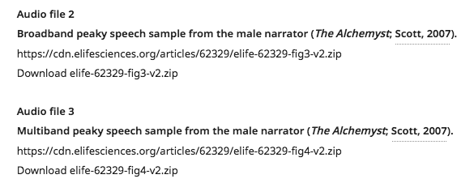
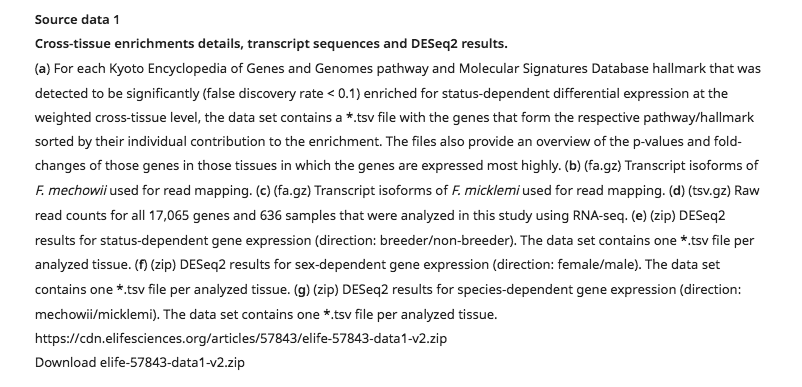
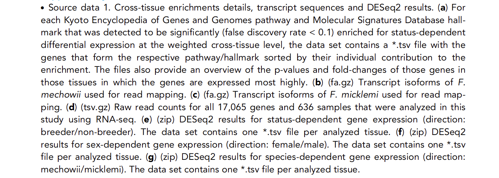
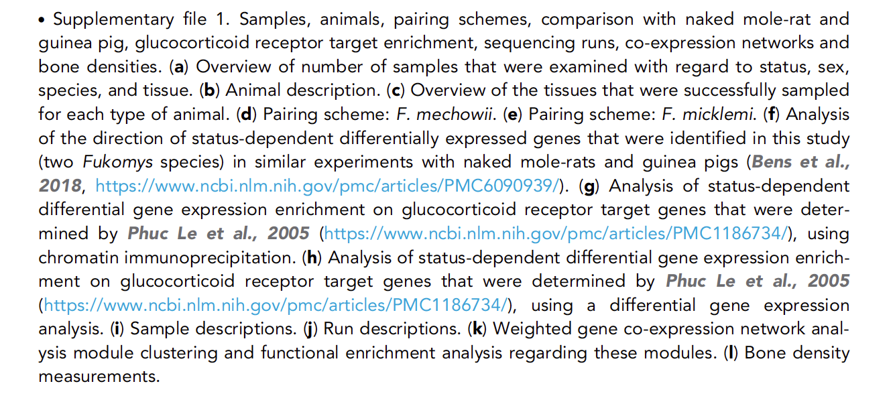

# Additional files

## What are additional files?

Besides the figures, figure supplements, tables and videos that are presented throughout an article, eLife also allows authors to include files that can be downloaded to support their findings. These can be uploaded at the level of the entire article \(in which case they sit in an 'additional files' section at the back of the article\) or to accompany particular display assets \(that is, they will be associated with a figure, table or video\). eLife allows the following varieties of additional file.

### Audio files

At present, eLife cannot support inline audio-only playback so audio files \(as distinct from videos\) should be included as additional files. These are treated in all respects like [**Supplementary files**](asset-source-files.md#supplementary-files), but are labelled as as Audio file 1, Audio file 2, etc.

They are published in the Additional files section. A descriptive title should be provided for each file and a legend may be present as well. 




### Reporting standards

Reporting standard documents describe particular protocols and standards that the authors followed when they were collecting their results. These generally take the form of check-lists. Please note that these are entirely distinct from the transparent reporting form that eLife requests authors complete on submission.

They are labelled as Reporting standard 1, Reporting standard 2, etc. A descriptive title should be provided and they are published in the Additional files section.


### Source files \(article-level\)

Source data and source code may be provided to give readers access to the raw data and the scripts that were used to process it. During the submission process, authors are in fact encouraged to provide these files to aid the reviewers and, in the event of acceptance, to allow readers to easily reproduce the work.

In the event that the data is too large or extensive to be neatly captured within one or two Excel files, it may be uploaded as a generated dataset to an external repository. In such cases, it should not be listed as a source data file but instead described in the [**Data availability section**](../data-availability.md). See **below** for how to deal with cases where authors become confused on this point.

Source code may also be uploaded to an external repository such as GitHub and this is often preferable to being included as an attached file as it permits proper licensing of the code \(see [**Archiving code**](../../../toolkit/archiving-code.md) for more details on this\). Again, if source code is hosted away from the article, it should not be listed as a source code file.

These file-types are labelled respectively Source data 1, Source data 2, etc. and Source code 1, Source code 2, etc. Each source data and source code file should have a descriptive title and may be accompanied by a legend. They are published in the Additional files section at the back of the article.






### Source files \(asset-level

Figures \(and their supplements\), videos and tables may be accompanied by the source data and/or source code that was used to generate them. The source data will usually consist of tables of raw data but may also include unprocessed images, editable version of charts provided as flat images, or multiple-page documents that cannot be typeset as single figures/figure supplements. Source code will usually comprise scripts that were used to process the data or to generate the graphs shown in figures.

To indicate that they are associated with a display asset, these files will be named Figure 1—source data 1, Figure 2—figure supplement 1—source data 1, Table 3—source data 1, Video 4—source data 1, etc. and Figure 1—source code 1, Figure 2—figure supplement 1—source code 1, Table 3—source code 1, Video 4—source code 1, etc. The numbering restarts for each asset e.g. Figure 1—source data 1, Figure 2—source data 1, Figure 2—source data 2, Figure 3—source data 1. Like article-level source data and source code files, they should have a descriptive title and may be accompanied by a legend. They are displayed in context with the main asset to which they relate.


### Supplementary files

When authors have accompanying documents that do not fit into the other categories of additional file, they may include these as supplementary files. These can cover lists of plasmids, operating manuals for resources, experimental design documentation, supporting tables that do not count as source data, lists of datasets used, and so on. Broadly speaking it is preferable that authors use one of the specific categories of file and include tables in their main text but eLife accepts this is not always possible.

Supplementary files are published in the Additional files section and should have a descriptive title. A legend may also be provided with a fuller description of the file contents.




### Transparent reporting form

To facilitate the interpretation and replication of experiments, authors as asked during full submission to provide information relating to sample-size estimation, replicates, and statistical reporting. They are encouraged to fill out a template form \(available as a [**PDF**](https://elife-cdn.s3.amazonaws.com/xpub/guides/transparent_reporting.pdf) ****or a [**Word file**](https://elife-cdn.s3.amazonaws.com/xpub/guides/transparent_reporting.docx)\) describing the places within the article where this information has been included. This transparent reporting form is them published alongside the version of record.

It is important to note that while TRFs accompany most articles, they are not mandatory. If, for example, an article does not describe experiments or the analysis of data \(as might be the case in a Tools and Resources submission\), the form would not be applicable.

Transparent reporting forms do not require a title or legend and are published at the end of the Additional files section.


## What needs to be checked?


## Schematron checks

### Content checks

#### supplementary-material-test-2

**Warning**: _XXXXXX is missing a title/caption - is this correct? \(supplementary-material should have a child caption.\)_

**Action**: This warning indicates that an additional file does not have a title or legend. The author should be queried to provide one if possible.

#### pre-supplementary-material-test-3

**Warning**: _XXXXXX does not have a title._

**Action**:  This warning indicates that an additional file does not have a title or legend. The author should be queried to provide one:


#### final-supplementary-material-test-3

**Warning**: _XXXXXX doesn't have a title. Is this correct?_

**Action**: 

#### pre-supplementary-material-test-5

**Warning**: _XXXXXX is missing a file \(supplementary-material missing a media element\) - please ensure that this is queried with the author._

**Action**: 

#### final-supplementary-material-test-5

**Error**: _XXXXXX is missing a file \(supplementary-material must have a media\)._

**Action**: 

#### supplementary-material-test-6

**Error**: _supplementary-material label \(XXXXXX\) does not conform to eLife's usual label format._

**Action**:

#### supplementary-material-test-7

**Error**: _supplementary-material in additional files sections cannot have the a media element with the attribute mimetype='video'. This should be mimetype='application'_

**Action**:

#### supplementary-material-test-8

**Error**: _XXXXXX has an article level label but it is not captured in the additional files section - This must be incorrect._

**Action**:

#### supplementary-material-test-9

**Error**: _XXXXXX has XXXXXX media elements which is incorrect._

**Action:**

#### supplementary-material-test-10

**Warning**: _Article contains XXXXXX Please check with eLife - is this actually a reporting standard?_

**Action**:

#### source-code-test-1

**Warning**: _XXXXXX has a file which looks like code - XXXXXX, but it's not labelled as code._

**Action**: 

#### supplementary-material-test-11

**Warning**: _XXXXXX has a title 'XXXXXX'. Is it a Key resources table? If so, it should be captured as a table in an appendix for the article._

**Action**: 

#### source-code-test-2

**Warning**: _Source code files should always be zipped. The file type for XXXXXX is 'XXXXXX'. Please zip this file, and replace it with the zipped version._

**Action**: 

#### back-supplementary-file-position

**Error**: _XXXXXX id ends with XXXXXX, but it is placed XXXXXX. Either it is mislabelled, the id is incorrect, or it should be moved to a different position._

**Action**: 

#### back-supplementary-file-id

**Error**: _The id \(XXXXXX\) for XXXXXX is not in the correct format. Supplementary files need to have ids in the format 'supp0'._

**Action**: 

#### back-source-data-position

**Error**: _XXXXXX id ends with XXXXXX, but it is placed XXXXXX. Either it is mislabelled, the id is incorrect, or it should be moved to a different position._

#### back-source-data-id

**Error**: _The id \(XXXXXX\) for XXXXXX is not in the correct format. Source data need to have ids in the format 'sdata0'._

**Action**: 

#### back-source-code-position

**Error**: _XXXXXX id ends with XXXXXX, but it is placed XXXXXX. Either it is mislabelled, the id is incorrect, or it should be moved to a different position._

**Action**: 

#### back-source-code-id

**Error**: _The id \(XXXXXX\) for XXXXXX is not in the correct format. Source code needs to have ids in the format 'scode0'._

**Action**: 

#### fig-data-test-1

**Warning**: _XXXXXX is figure level source data, but contains 1 figure citation which is a link to a figure supplement - should it be figure supplement level source data?_

**Action**: This warning indicates that the description for a source data file associated with a main figure contains a citation to a figure supplement. In cases where the source data title or legend mentions both the main figure and one or more figure supplements \(e.g. "Source data for Figure 3A and Figure 3—figure supplement 1"\) this warning can be ignored. In cases where only a figure supplement is mentioned \(e.g. "Source data for Figure 4—figure supplement 1D"\) the source data should be moved so that it is associated with the cited figure supplement.

In cases where the source data title or legend mentions multiple figure supplements \(e.g. Source data for Figure 1–figure supplements 1–4"\) it is appropriate to leave it associated with the main figure \(Figure 1 in this example\) since it wouldn't be correct to associate it with any single figure supplement.

#### fig-code-test-1

**Warning**: _XXXXXX is figure level source code, but contains 1 figure citation which is a link to a figure supplement - should it be figure supplement level source code?_

**Action**: This warning indicates that the description for a source code file associated with a main figure contains a citation to a figure supplement. In cases where the source code title or legend mentions both the main figure and one or more figure supplements \(e.g. "Source code for Figure 3A and Figure 3—figure supplement 1"\) this warning can be ignored. In cases where only a figure supplement is mentioned \(e.g. "Source code for Figure 4—figure supplement 1D"\) the source code should be moved so that it is associated with the cited figure supplement.

In cases where the source code title or legend mentions multiple figure supplements \(e.g. Source code for Figure 1–figure supplements 1–4"\) it is appropriate to leave it associated with the main figure \(Figure 1 in this example\) since it wouldn't be correct to associate it with any single figure supplement.

#### fig-data-test-2

**Error**: _'XXXXXX' ends with XXXXXX, but it is placed XXXXXX. Either it is misnumbered or it should be moved to a different position._

**Action**:

#### fig-data-id

**Error**: _The id for figure level source data must be the id of its ancestor fig, followed by 'sdata', followed by its position relative to other source data for the same figure. The id for XXXXXX, 'XXXXXX' is not in this format. It should be 'XXXXXX' instead._

**Action**:

#### fig-code-test-2

**Error**: _'XXXXXX' ends with XXXXXX, but it is placed XXXXXX. Either it is misnumbered or it should be moved to a different position._

**Action:**

#### fig-code-id

**Error**: _The id for figure level source code must be the id of its ancestor fig, followed by 'scode', followed by its position relative to other source data for the same figure. The id for XXXXXX, 'XXXXXX' is not in this format. It should be 'XXXXXX' instead._

**Action**:

#### vid-data-test-2

**Error**: 'XXXXXX' ends with XXXXXX, but it is placed XXXXXX. Either it is misnumbered or it should be moved to a different position.

**Action**:

#### vid-data-id

**Error**: _The id for video level source data must be the id of its ancestor video, followed by 'sdata', followed by its position relative to other source data for the same video. The id for XXXXXX, 'XXXXXX' is not in this format. It should be 'XXXXXX' instead._

**Action**:

#### vid-code-test-2

**Error**: _'XXXXXX' ends with XXXXXX, but it is placed XXXXXX. Either it is misnumbered or it should be moved to a different position._

**Action**:

#### vid-code-id

**Error**: _The id for video level source code must be the id of its ancestor video, followed by 'scode', followed by its position relative to other source data for the same video. The id for XXXXXX, 'XXXXXX' is not in this format. It should be 'XXXXXX' instead._

**Action:**

#### table-data-test-2

**Error**: _'XXXXXX' ends with XXXXXX, but it is placed XXXXXX. Either it is misnumbered or it should be moved to a different position._

**Action**:

#### table-data-id

**Error**: _The id for table level source data must be the id of its ancestor table-wrap, followed by 'sdata', followed by its position relative to other source data for the same table. The id for XXXXXX, 'XXXXXX' is not in this format. It should be 'XXXXXX' instead._

**Action**:

#### table-code-test-2

**Error**: _'XXXXXX' ends with XXXXXX, but it is placed XXXXXX. Either it is misnumbered or it should be moved to a different position._

**Action:**

#### table-code-id

**Error**: _The id for table level source code must be the id of its ancestor table, followed by 'scode', followed by its position relative to other source data for the same table. The id for XXXXXX, 'XXXXXX' is not in this format. It should be 'XXXXXX' instead._

**Action**:

### Structure checks

#### supplementary-material-test-1

**Error**: _supplementary-material must have a label._

**Action**: 

## XML

A reporting standard file in the additional files section.

```markup
<sec id="s5" sec-type="supplementary-material">
    <title>Additional files</title>
    <supplementary-material id="repstand1">
        <label>Reporting standard 1.</label>
        <caption>
            <title>STROBE checklist.</title>
        </caption>
        <media mime-subtype="docx" mimetype="application"
        xlink:href="elife-67569-repstand1-v3.docx"/>
    </supplementary-material>
</sec>
```

A transparent reporting form in the additional files section. Note there is no caption, just a label.

```markup
<sec id="s5" sec-type="supplementary-material">
    <supplementary-material id="transrepform">
        <label>Transparent reporting form</label>
        <media mime-subtype="pdf" mimetype="application"
        xlink:href="elife-67569-transrepform-v3.pdf"/>
    </supplementary-material>
</sec>
```

A source code file in the additional files section.

```markup
<sec id="s6" sec-type="supplementary-material">
    <title>Additional files</title>
    <supplementary-material id="scode1">
        <label>Source code 1.</label>
        <caption>
            <title>MATLAB scripts for tracking analysis and MSD/
            <italic>osd</italic><sup>2</sup> calculation.</title>
        </caption>
        <media mime-subtype="zip" mimetype="application"
        xlink:href="elife-64207-code1-v2.zip"/>
    </supplementary-material>
</sec>
```

A source data file in the additional files section with a long legend.

```markup
<sec id="s6" sec-type="supplementary-material">
    <title>Additional files</title>
    <supplementary-material id="sdata1">
        <label>Source data 1.</label>
        <caption>
            <title>Cross-tissue enrichments details, transcript sequences and DESeq2 results.</title>
            <p>(<bold>a</bold>) For each Kyoto Encyclopedia of Genes and Genomes pathway
            and Molecular Signatures Database hallmark that was detected to be
            significantly (false discovery rate &lt; 0.1) enriched for status-dependent
            differential expression at the weighted cross-tissue level, the data set
            contains a *.tsv file with the genes that form the respective pathway/hallmark
            sorted by their individual contribution to the enrichment. The files also
            provide an overview of the p-values and fold-changes of those genes in those
            tissues in which the genes are expressed most highly. (<bold>b</bold>) (fa.gz)
            Transcript isoforms of <italic>F. mechowii</italic> used for read mapping.
            (<bold>c</bold>) (fa.gz) Transcript isoforms of <italic>F. micklemi</italic>
            used for read mapping. (<bold>d</bold>) (tsv.gz) Raw read counts for all 17,065
            genes and 636 samples that were analyzed in this study using RNA-seq. (<bold>e</bold>)
            (zip) DESeq2 results for status-dependent gene expression (direction: breeder/
            non-breeder). The data set contains one *.tsv file per analyzed tissue. (<bold>f</bold>)
            (zip) DESeq2 results for sex-dependent gene expression (direction: female/male).
            The data set contains one *.tsv file per analyzed tissue. (<bold>g</bold>)
            (zip) DESeq2 results for species-dependent gene expression (direction:
            mechowii/micklemi). The data set contains one *.tsv file per analyzed
            tissue.</p>
        </caption>
        <media mime-subtype="zip" mimetype="application"
        xlink:href="elife-57843-data1-v2.zip"/>
    </supplementary-material>
</sec>
```

Supplementary files in the additional files section.

```markup
<sec id="s6" sec-type="supplementary-material">
    <title>Additional files</title>
    <supplementary-material id="supp1">
        <label>Supplementary file 1.</label>
        <caption>
            <title>Table of RNAseq (Tab 1) and GO Term analysis (Tab 2) for Sun dKO versus
            WT mouse keratinocytes grown in low calcium media (undifferentiated).</title>
        </caption>
        <media mime-subtype="xlsx" mimetype="application"
        xlink:href="elife-58541-supp1-v2.xlsx"/>
    </supplementary-material>
    <supplementary-material id="supp2">
        <label>Supplementary file 2.</label>
        <caption>
            <title>Table of RNAseq (Tab 1) and GO Term analysis (Tab 2) for Sun dKO versus
            WT mouse keratinocytes grown in high calcium media (differentiated).</title>
        </caption>
        <media mime-subtype="xlsx" mimetype="application"
        xlink:href="elife-58541-supp2-v2.xlsx"/>
    </supplementary-material>
</sec>
```

Supplementary file followed by audio files in the additional files section. Note that the IDs for these follow the same pattern at present, so Audio file 1 is supp2, Audio file 2 is supp 3 etc.

```markup
<sec id="s6" sec-type="supplementary-material">
    <title>Additional files</title>
    <supplementary-material id="supp1">
        <label>Supplementary file 1.</label>
        <caption>
            <title>Details of statistical models.</title>
        </caption>
        <media mime-subtype="docx" mimetype="application"
        xlink:href="elife-62329-supp1-v2.docx"/>
    </supplementary-material>
    <supplementary-material id="supp2">
        <label>Audio file 1.</label>
        <caption>
            <title>Unaltered speech sample from the male narrator (<italic>The
            Alchemyst</italic>; <xref ref-type="bibr" rid="bib56">Scott, 2007</xref>).</title>
        </caption>
        <media mime-subtype="zip" mimetype="application"
        xlink:href="elife-62329-fig2-v2.zip"/>
    </supplementary-material>
    <supplementary-material id="supp3">
        <label>Audio file 2.</label>
        <caption>
            <title>Broadband peaky speech sample from the male narrator (<italic>The
            Alchemyst</italic>; <xref ref-type="bibr" rid="bib56">Scott, 2007</xref>).</title>
        </caption>
        <media mime-subtype="zip" mimetype="application"
        xlink:href="elife-62329-fig3-v2.zip"/>
    </supplementary-material>
</sec>
```


