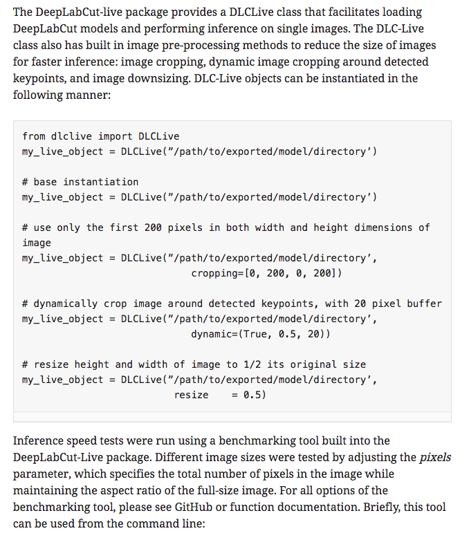
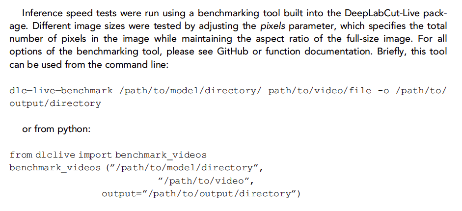

# Code blocks

## What are code blocks?

Authors will sometimes include snippets of code in their articles. This is usually either to illustrate the computational methods that they have used in their work or to provide user guidance to allow readers to replicate that work. Since the exact layout of code is usually important, this needs to be preserved using a 'code block'.

Within a code block, all text is rendered in a monospace font and the spacing and line-breaks are preserved. Anything that would normally be treated as XML tagging will be rendered as provided, rather than as formatting or links \(e.g. '&lt;bold&gt;some text&lt;/bold&gt;' instead of '**some text'**\). As a result, it is not possible to place hyperlinks, formatting or coloured text within a code block. Please note that some authors do provide colour-coding within their code, so it may need to be explained to them that this cannot be preserved.

## Inline code

Not all code provided in eLife articles will be intended for presentation in a code block. Sometimes authors will provide code snippets or even just the names of particular commands inline as part of a normal paragraph. In these cases, the code may be rendered in monospace so that it is visually distinct from the surrounding text.

code-child-test	code	\*\*Error\*\*: \_code contains a child element, which will display in HTML with its tagging, i.e. '&lt;XXXXXXXXXXXX&gt;XXXXXX&lt;/XXXXXX&gt;'. Strip any child elements.\_

code-parent-test	code	\*\*Error\*\*: \_code element \(containing the content XXXXXX\) is directly preceded by another code element \(containing the content XXXXXX\). If the content is part of the same code block, then it should be captured using only 1 code element and line breaks added in the xml. If these are separate code blocks \(uncommon, but possible\), then this markup is fine.\_

code-sibling-test	p\[count\(code\) gt 1\]/code\[2\]	\*\*Warning\*\*: \_code element \(containing the content XXXXXX\) is directly preceded by another code element \(containing the content XXXXXX\). If the content is part of the same code block, then it should be captured using only 1 code element and line breaks added in the xml. If these are separate code blocks \(uncommon, but possible\), then this markup is fine.\_

code-sibling-test-2	p\[count\(code\) = 1\]/code	\*\*Warning\*\*: \_code element \(containing the content XXXXXX\) is directly preceded by another code element \(containing the content XXXXXX\). If the content is part of the same code block, then it should be captured using only 1 code element and line breaks added in the xml. If these are separate code blocks \(uncommon, but possible\), then this markup is fine.\_

code-test	p\|td\|th	\*\*Warning\*\*: \_XXXXXX element contains what looks like unformatted code - 'XXXXXX' - does this need tagging with &lt;monospace/&gt; or &lt;code/&gt;?\_

empty-parentheses-presence	p\|td\|th\|title\|xref\|bold\|italic\|sub\|sc\|named-content\|monospace\|code\|underline\|fn\|institution\|ext-link	\*\*Warning\*\*: \_XXXXXX element contains empty parentheses \('\[\]', or '\(\)'\). Is there a missing citation within the parentheses? Or perhaps this is a piece of code that needs formatting?\_

