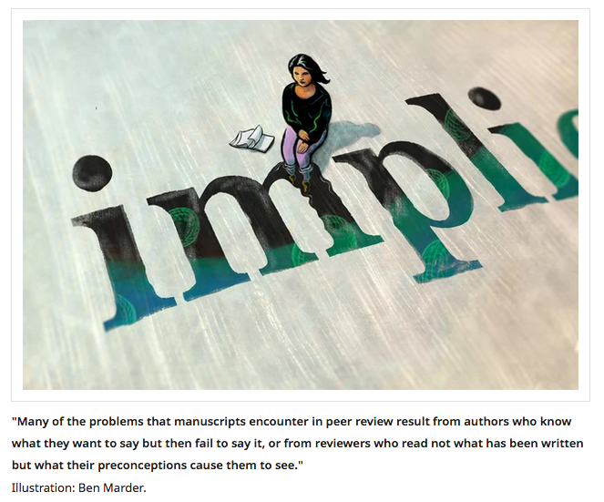
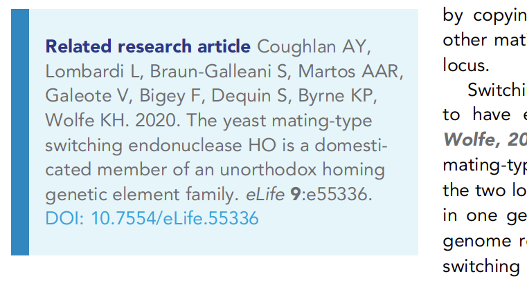
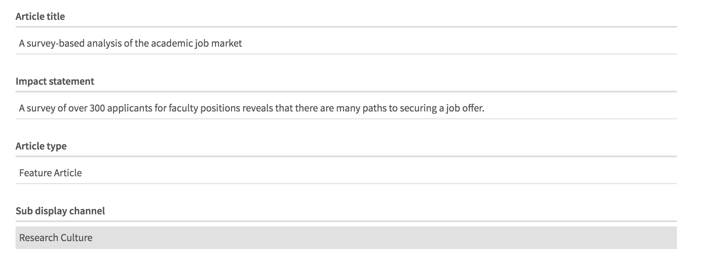

# Feature content

## What is Feature content?

At eLife, the term 'Feature content' covers all non-research content published by the journal. This is synonymous with 'Magazine content' and can be found under this heading on the eLife website: [https://elifesciences.org/magazine](https://elifesciences.org/magazine).

This content is overseen by the Features team and consists in part of blogposts and [podcasts](https://elifesciences.org/podcast) that do not required Production intervention to publish. Digests are also published in a dedicated [section](https://elifesciences.org/digests) under the magazine heading, in addition to being included in the related article.

In addition to this, however, there are four categories of Feature article that come through the Production process:

* **Insight** - a commentary article accompanying one or more research articles, usually written by the editors or reviewers who worked on the article, providing context for a broader audience and discussing the importance of the findings being reported.
* **Editorial** - an editorial piece written by one or more of eLife's deputy or senior editors, or the editor-in-chief, usually addressing a specific issue or development in the scientific community and/or eLife in particular.
* **Feature contribution** - an article that is not reporting any scientific findings but instead offers a perspective or comment on events, issues or developments in the scientific community.
* **Feature research** - an article that reports the results of meta-research; that is, studies carried out on the research community and its practices - research on how research is done. 

### Feature templates

There are five Feature templates that map to the above article types. Aside from differences in the content of the articles, these reflect different PDF layouts.

| Template number | Article type | PDF format | Possible content |
| :--- | :--- | :--- | :--- |
| Template 1 | Insight | Two column, with key information box on first page; one-sentence abstract displayed as stand-first | Labelled figures, no digest, no decision/response, no editors/reviewers, no funding, no data availability |
| Template 2 | Editorial | Two column, one-sentence abstract displayed as stand-first | Illustrations, no digest, pull-quotes, no decision/response, no editors/reviewers, no funding, no data availability |
| Template 3 | Feature contribution | Two column, one-sentence abstract displayed as stand-first | Illustrations, no digest, pull-quotes, no decision/response, no editors/reviewers, no funding, no data availability |
| Template 4 | Feature contribution | Two column, full abstract | Labelled figures, tables, boxes, no digest, pull-quotes, no decision/response, no editors/reviewers, no funding, no data availability |
| Template 5 | Feature research | Two column, full abstract | Labelled figures, tables, boxes, no digest, possible decision/response, editors/reviewers, funding information, data availability section |

The template for each Feature article will be indicated using the article file name in the exported files, for example "elife50543\_template3.docx" or "elife46563\_template4.docx".

### Unique features of Feature content

Feature content includes the following items not found in research content:

* **Title prefix** - a brief category label displayed in front of the title, currently captured in the XML as a 'sub-display-channel' subject element. Text is given in title case.

* **Author bio** - a short description of the author's affiliation and any notable positions held. This is given in addition to author affiliations, rather than replacing them, but supercedes them for display.

* **Illustrations** - unlabelled figures with a single sentence description. May also include an attribution.

* **Key info box** - in Insights specifically, the details of the article\(s\) being commented upon are given in a box on the first page of the PDF. This content is not currently displayed online.

## Submission and export of Feature content

Feature content is submitted to eLife via two paths: articles submitted via the the normal submission process and articles commissioned or invited by the Feature team.

## Production process for Feature content

### Pre-editing

### Pre-author check

#### Title prefix

The title prefix is displayed as the 'sub display channel' in the article details page.

#### Author bio

The author bio displays under the author name and can be edited in the author details panel.

Each author should be assigned the same affiliations that are described in the bio. Note that these do not have to be exactly the same. For example, an affiliation may be described as "" but would be entered as two affiliations, "" and "".

### Author proofing

### Feature review

## Schematron checks

#### feat-custom-meta-test-1

**Error**: _XXXXXX is not allowed in a Template type meta-value._

**Action**: 

#### feat-custom-meta-test-2	

**Error**: _Template type meta-value must one of '1','2','3','4', or '5'._

**Action**: 

#### feat-custom-meta-test-info	

**Info**: _Template XXXXXX._

**Action**: No action required, this is just an information message stating the template used for the article.

#### feat-custom-meta-test-3	

**Error**: _XXXXXX must be a template 1. Currently it is a template XXXXXX._

**Action**:

#### feat-custom-meta-test-4	

**Error**: _XXXXXX must be a template 2. Currently it is a template XXXXXX._

**Action**: 

#### feat-custom-meta-test-5

**Error**: _XXXXXX must be a template 3, 4, or 5. Currently it is a template XXXXXX._

**Action**:

