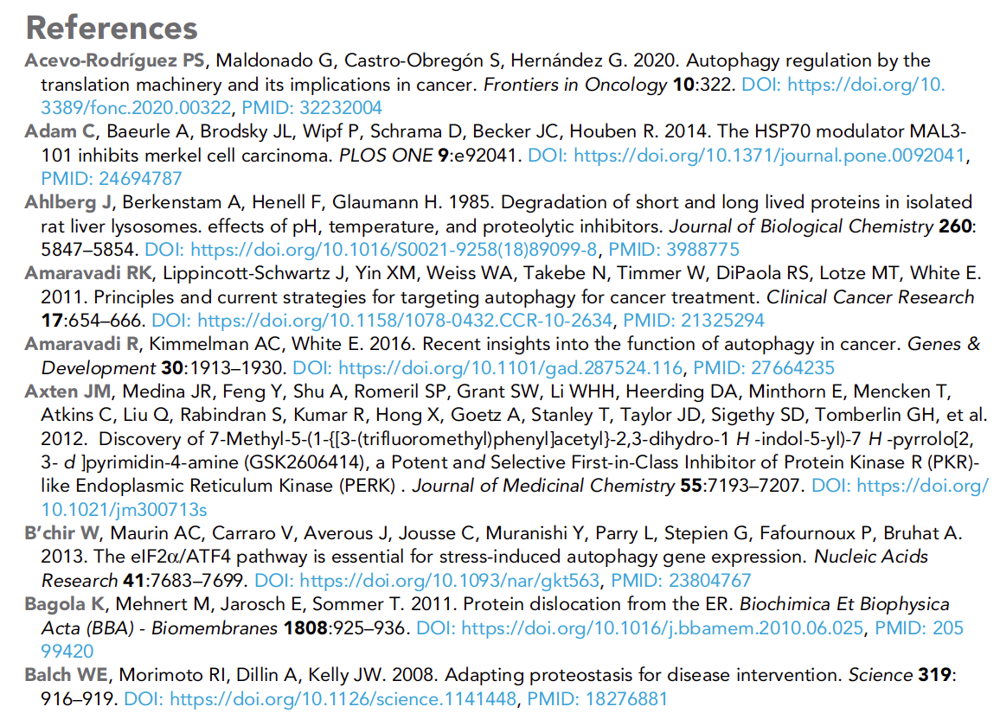

# References

## What is a reference list?

Most eLife articles will include a reference list \(otherwise known as a bibliography\) that contains details for all the previous work being cited in the text. These will usually consist mostly of journal articles and books but may also cover websites, papers presented at conferences, software, data and other published material. Whenever research is published, it will be supported with a large number of references; we have had articles with upwards of 150 references. Some review articles, which survey the available literature on a subject, may reach as high as 200+ references.

The reference list is included at the end of the article, in the back matter. References are ordered alphabetically by the surname of the first author for each entry, then by year, and then by the surnames of the second, third, fourth etc authors as necessary. Each reference list covers the entire article in which it appears; references in appendices are not treated separately from those in the main text.

## What needs to be checked?

## Schematron warnings

The following rules apply to all references.

Add info about years \(a, b\) if two references are the same

### Content warnings

List of errors and warnings that can occur, with guidance on how to solve each problem or on when it is OK to let the warning go by and not change anything.

These warnings relate to the content of XXXXXX.

#### duplicate-ref-test-4

**Warning:** _ref 'XXXXXX' has the same title as another reference, but a different source. Is this correct? - 'XXXXXX'_

**Action:** This warning will appear if two references have the same titles. This may happen if the authors include two separate reference lists which have been collated into one, leaving duplicate references. Check the details of both references and if the information is exactly the same, delete one of the duplicates. If the other details of the references differ \(e.g. year, author list, where the article was published\), then both references should be kept. For example, this warning will fire if the two references below are in the same article. However, as the other details of the references differ, both should be kept in the reference list. 

### XML structure warnings

These warnings relate to the XML structure of XXXXXX. For more information about what the XML should look like, see below \(include link to XML structure\).

#### id-x

**Warning/Error:** content of message

**Action:** What to do if this message fires

