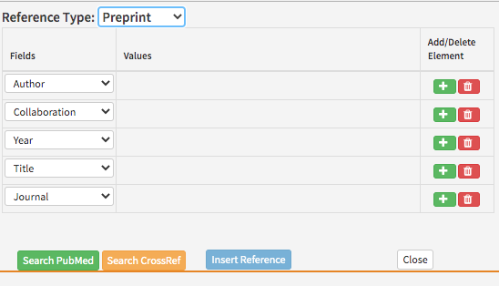
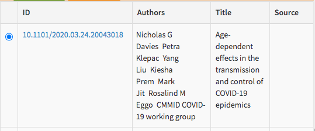

# Preprint references

## What is a preprint?

A preprint is an article which has been published online, but has not gone through any form of peer review. Preprints may undergo peer review subsequent to their initial publication, and may potentially then be published in an academic journal. Popular preprint servers include \(but are not limited to\) bioRxiv, arXiv, chemRxiv, medRxiv and so on.

## What is a preprint reference?

A preprint reference provides the bibliographic details for a preprint in the reference list.


## What needs to be added?

The following information can be added for preprint references:

<table>
  <thead>
    <tr>
      <th style="text-align:left">Kriya field</th>
      <th style="text-align:left">Mandatory?</th>
      <th style="text-align:left">XML element</th>
      <th style="text-align:left">Example</th>
    </tr>
  </thead>
  <tbody>
    <tr>
      <td style="text-align:left">Author(s)</td>
      <td style="text-align:left">At least one author or collaboration is required; both can be present</td>
      <td
      style="text-align:left">&lt;person-group person-group-type=&quot;author&quot;&gt;&lt;name&gt;&lt;surname&gt;Davies&lt;/surname&gt;
        &lt;given-names&gt;NG&lt;/given-names&gt;&lt;/name&gt;&lt;/person-group&gt;</td>
        <td
        style="text-align:left">Davies NG</td>
    </tr>
    <tr>
      <td style="text-align:left">Collaboration(s)</td>
      <td style="text-align:left">At least one author or collaboration is required; both can be present</td>
      <td
      style="text-align:left">&lt;person-group person-group-type=&quot;author&quot;&gt;&lt;collab&gt;Tulsa
        1000 Investigators&lt;/collab&gt;&lt;/person-group&gt;</td>
        <td style="text-align:left">Tulsa 1000 Investigators</td>
    </tr>
    <tr>
      <td style="text-align:left">Year</td>
      <td style="text-align:left">Yes</td>
      <td style="text-align:left">&lt;year iso-8601-date=&quot;2020&quot;&gt;2020&lt;/year&gt;</td>
      <td style="text-align:left">2020</td>
    </tr>
    <tr>
      <td style="text-align:left">Title</td>
      <td style="text-align:left">Yes</td>
      <td style="text-align:left">&lt;article-title&gt;Age-dependent effects in the transmission and control
        of COVID-19 epidemics&lt;/article-title&gt;</td>
      <td style="text-align:left">Age-dependent effects in the transmission and control of COVID-19 epidemics</td>
    </tr>
    <tr>
      <td style="text-align:left">Preprint server</td>
      <td style="text-align:left">Yes</td>
      <td style="text-align:left">&lt;source&gt;medRxiv&lt;/source&gt;</td>
      <td style="text-align:left">medRxiv</td>
    </tr>
    <tr>
      <td style="text-align:left">DOI</td>
      <td style="text-align:left">At least one DOI or URL is required, and they are mutually exclusive</td>
      <td
      style="text-align:left">&lt;pub-id pub-id-type=&quot;doi&quot;&gt;10.1101/2020.03.24.20043018&lt;/pub-id&gt;</td>
        <td
        style="text-align:left">10.1101/2020.03.24.20043018</td>
    </tr>
    <tr>
      <td style="text-align:left">URL</td>
      <td style="text-align:left">At least one DOI or URL is required, and they are mutually exclusive</td>
      <td
      style="text-align:left">
        <p>&lt;ext-link ext-link-type=&quot;uri&quot; xlink:href=&quot;https://www.medrxiv.org/content/10.1101/2020.03.24.20043018v2&quot;&gt;</p>
        <p>https://www.medrxiv.org/content/10.1101/2020.03.24.20043018v2&lt;/ext-link&gt;</p>
        </td>
        <td style="text-align:left">https://www.medrxiv.org/content/10.1101/2020.03.24.20043018v2</td>
    </tr>
  </tbody>
</table>

Validation of references via the Crossref API tool should pull in the information \(preprints are not currently available on PubMed but they may be in the near-ish future\) if the author did not provide them. Schematron warnings may also pick them up and should be checked at source.

* **Authors**: Enter each author name as a surname\(s\) followed by initials. 
* **Collaboration:** Preprints can have group or individual authors or a combination of both. Group authors should be placed in the order in which they appear in the original source. An author list can be a mix of both individual and group authors e.g. Smith J, Jones T, National Institutes of Health, Bloggs J etc.
* **Year**: This should be the year the preprint was published. This field can include a letter suffix \(e.g. 2020a\) if needed to distinguish between citations \(see more [here](../reference-citations.md#what-is-a-reference-citation)\).
* **Title**: The title of the article. Can contain italics, superscript and subscript as required.
* **Preprint server**: The full \(not abbreviated\) name of the server in which the preprint was published.
* **DOI:** The Digital Object Identifier for the preprint \(if applicable\).
* **URL:** The URL for a preprint \(if applicable\).

Please note that publication ids such as `2020.03.24.20043018` are not currently captured by eLife, but they will be in the future.

If any of the mandatory information is not provided, look up the preprint on the preprint server. You should be able to find all the mandatory information there. In the event that you cannot find it, please leave the following author query, replacing 'XXXXXX' with the missing information:

* Please provide the XXXXXX for this reference.

## **How to add a preprint reference**

Right-click where you want to add the citation and click on Add New &gt; Add New Reference and select Preprint under Reference Type.



The default fields in Kriya will need to be altered to include the following information in the order below. To delete an unnecessary field click the red 'bin' button \(if this doesn't work, try re-validating after all fields have been filled out, or change the field type to the one you need\). To add a field click the green '+' button to the entry above where you need to add it.

* Author 
* Collaboration \(if applicable\)
* Year 
* Title
* Journal \(preprint server\)
* Website \(if applicable\)
* DOI \(if applicable\)

Note that preprint references must have either a DOI or a Website.

Once you have entered the information in the fields, click on 'Search Crossref'. This will compare the information entered to the Crossref database and ensures that a DOI is added \(if there is one - not all journals use DOIs\).


Click the article with the correct authors, title and journal. This will automatically fill in the remaining fields if the information hasn't been added already.




The minimum fields that need to be populated for the PubMed and CrossRef validators to find an article are:

* First author name
* Year
* Title
* Journal

Some preprint references will not appear when searching the CrossRef database \(not all of them have DOIs\). If you have entered the article details correctly and verified that it is the same in the original submitted version, you can just click on 'Insert Reference' to add the reference to the article.

## Updating a preprint reference to a journal reference

If a preprint has been published while an eLife article is in the production process, it may be necessary to update it to a journal reference \(see [Journal references](journal-references.md)\). This should only be done on the instruction of the author\(s\) of the eLife article, in other words, there is no need to check every preprint reference in order to determine whether it has been published as a journal.

## Schematron checks 

### Content checks

These checks relate to the content of journal references. X or XXXXXX refers to quoted text which will change depending on the article.

### XML Structure checks

These checks relate to the XML structure of journal references. For more information about what the XML should look like, [**see below**](pre-print-references.md#xml-structure).

## XML structure

Here are some examples of how the XML will look for various preprint references.

Preprint reference with a doi.

```markup
<ref id="bib6">
    <element-citation publication-type="preprint">
        <person-group person-group-type="author">
            <name>
                <surname>Davies</surname>
                <given-names>NG</given-names>
            </name>
            <name>
                <surname>Klepac</surname>
                <given-names>P</given-names>
            </name>
            <name>
                <surname>Liu</surname>
                <given-names>Y</given-names>
            </name>
            <name>
                <surname>Prem</surname>
                <given-names>K</given-names>
            </name>
        </person-group>
        <year iso-8601-date="2020">2020</year>
        <article-title>Age-dependent effects in the transmission and control of COVID-19
            epidemics</article-title>
        <source>medRxiv</source>
        <pub-id pub-id-type="doi">10.1101/2020.03.24.20043018</pub-id>
    </element-citation>
</ref>
```

Preprint reference with a URL.

```markup
<ref id="bib28">
    <element-citation publication-type="preprint">
        <person-group person-group-type="author">
            <name>
                <surname>Neto</surname>
                <given-names>EC</given-names>
            </name>
            <name>
                <surname>Hoff</surname>
                <given-names>BR</given-names>
            </name>
            <name>
                <surname>Bare</surname>
                <given-names>C</given-names>
            </name>
            <name>
                <surname>Bot</surname>
                <given-names>BM</given-names>
            </name>
            <name>
                <surname>Yu</surname>
                <given-names>T</given-names>
            </name>
            <name>
                <surname>Magravite</surname>
                <given-names>L</given-names>
            </name>
            <name>
                <surname>Stolovitzky</surname>
                <given-names>G</given-names>
            </name>
        </person-group>
        <year iso-8601-date="2016">2016</year>
        <article-title>Reducing overfitting in challenge-based competitions</article-title>
        <source>arXiv</source>
        <ext-link ext-link-type="uri" xlink:href="http://arxiv.org/abs/1607.00091"
            >http://arxiv.org/abs/1607.00091</ext-link>
    </element-citation>
</ref>
```

