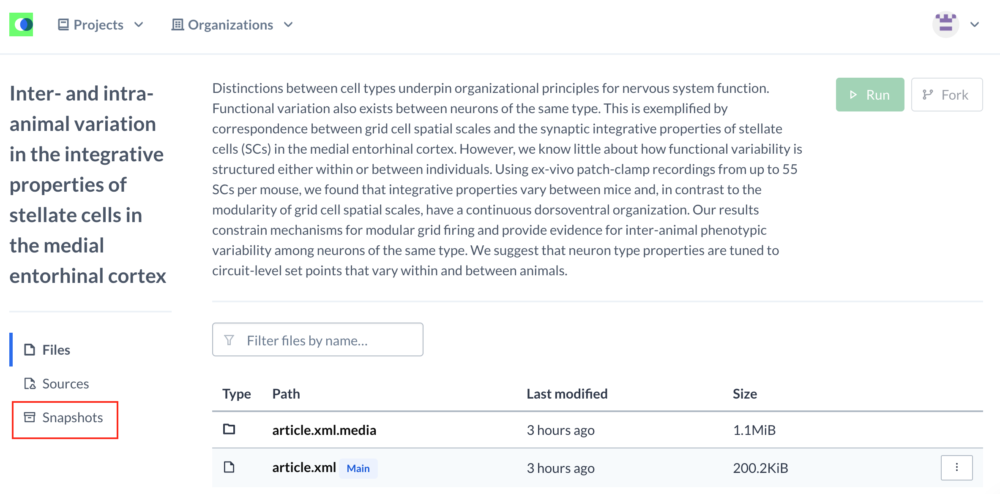
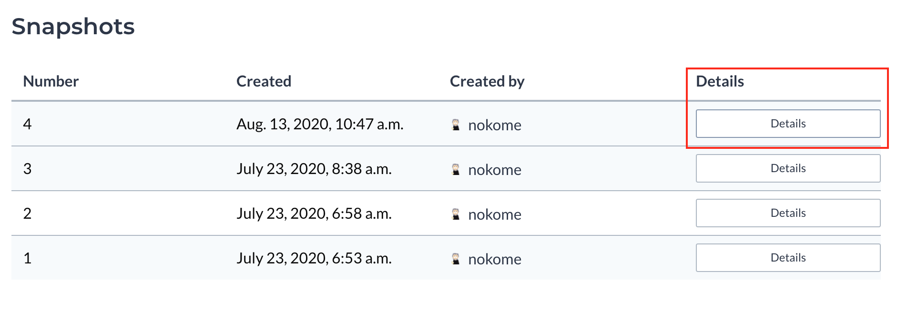

# ERA


For change log, click [**here**](../article-details/content/allowed-assets/figures.md#changelog).


## **What is an ERA**

An Executable Research Article is an article in which the code and data have been included as executable assets. A reader can make edits to this information, and execute the code in the browser to regenerate/manipulate figures, tables, and code blocks.  

See [**the Demo**](https://repro.elifesciences.org/example.html#) for an example.

More information \(more eloquently put\) in [**this blog post**](https://elifesciences.org/labs/b521cf4d/reproducible-document-stack-towards-a-scalable-solution-for-reproducible-articles).

**\[update blog post and demo links after ERA launch\]**

Note that ERAs used to be called RDSs \(which stood for Reproducible Document Stack\). While the two terms aren't necessarily interchangeable, unless specified, if someone refers to RDS they very likely mean ERA.

## Production's role in ERA

Production carry out three roles in the ERA process:

* **Point of contact for Authors who are ERA-ing their article**. If they have any technical questions, these should be directed to Stencila. However, any questions related to how they should present their content \(and so on\) are for Production to answer.
* **QC of an ERA**. QC-ing an ERA prior to publication fall within Production's remit.
* **Publication of ERAs**. Production are responsible for publishing ERAs.

## **ERA workflow**

1. **Approach**: The author\(s\) of an already published \(VoR\) eLife article contact eLife to let them know they would like to ‘ERA’ their article. They will likely be screened by someone else at eLife before being put in touch with Production.
2. **Authoring**: The author\(s\) follow [**guidelines**](http://help.stenci.la/en/articles/4184684-enriching-an-elife-article) which detail how to write reproducible articles as R Markdown or Jupyter Notebook documents in [**Stencila Hub**](https://hub.stenci.la/open/). These guidelines will include how to add the necessary metadata to each of these formats \(note that there is also an interactive wizard to help any user when first creating a project in Stencila Hub\). R Markdown and Jupyter Notebook are currently the only formats which are supported for ERAs. In the future this will be extended to other formats. 
3. **Uploading**: The author\(s\) upload their article, and necessary data and code files, to a “project” on [**Stencila Hub**](https://hub.stenci.la/open/).
4. **Building**: Using [**Stencilla Hub**](https://hub.stenci.la/open/), the author will build the article \(either by downloading the files in a supported format, updating those files locally and re-uploading; or by using Stencila’s Google Document Add-on \[which will be available at some time after launch\]\). They will add any code and data needed to make the article executable.
5. **Snapshot-ing**: The authors will ‘snapshot’ their ERA in Stencila Hub. This means saving a version of the article which is immutable \(will not be edited further\) for the purposes of publication. 
6. **Sharing**: The authors will share their ERA snapshot with the eLife production team. This will likely be in the form of an email from Stencila Hub containing a link to the article. \(There is a button in Stencila Hub which the author\(s\) can press to initiate this step\).
7. **QC**: A production team member will compare the ERA on Stencila Hub against the eLife VoR article. If any edits need to be made, these will have to be done by the authors in Stencila Hub, and after having done so they will have to send over a separate snapshot link. See **ERA QC** section below
8. **Publication**: The Production team member will publish the ERA on the eLife site \(see **Publishing an ERA** below\).

## ERA QC

\[To be filled out\]

## List of known supported and unsupported content

When an article is ERA'd, eLife JATS XML is converted to [**Schema.org**](https://schema.org/) using [**Encoda**](https://github.com/stencila/encoda). It is then converted into the authors selected format \(again, using Encoda\). This decoding and encoding process means that some content may only be partially retained or may not be retained at all.

Note, however, that during the 'building' process \(the process by which authors make their article executable\) it may be possible for this content to be added back in manually.

### Known supported content

* Article title
* Author names \(not `on-behalf-of`s\)
* Group authors \(sort of supported - may require Stencila intervention\)
* Author affiliations
* Publication date
* Main abstract
* Paragraphs
* Lists
* Tables
* Figures
* Figure supplements are stacked on top of Figures \(instead of being placed in an asset viewer\)
* Inline and display formulae
* Citations
* Certain references, and certain information in references

### Known unsupported content

* [MSAs](https://github.com/stencila/encoda/issues/468)
* [Underline formatting](https://github.com/stencila/encoda/issues/417)
* [Small Caps formatting](https://github.com/stencila/encoda/issues/416)
* [DOIs/PMIDs in references](https://github.com/stencila/encoda/issues/413)
* [Group authors in references](https://github.com/stencila/encoda/issues/411)
* [Acknowledgements](https://github.com/stencila/encoda/issues/410)
* [Data availability sections](https://github.com/stencila/encoda/issues/409)
* [Sections in the backmatter \(such as Additional files\)](https://github.com/stencila/encoda/issues/418)
* Author notes \(as a result of the above\)
* [Digests](https://github.com/stencila/encoda/issues/407)
* [Decision Letters/Author responses](https://github.com/stencila/encoda/issues/406)
* [Some section hierarchies](https://github.com/stencila/encoda/issues/405)
* [Videos](https://github.com/stencila/encoda/issues/404)
* [Appendices](https://github.com/stencila/encoda/issues/400)

### Known content issues

* [Problems with boxes](https://github.com/stencila/encoda/issues/419)
* [There are issues with non-journal references](https://github.com/stencila/encoda/issues/412)
* Simple lists will be rendered as bulleted lists

## **Publishing an ERA**

There are four steps to publishing an ERA:

1. Obtain the relevant links from the Stencila Hub project.
2. Edit [**this YAML file**](https://github.com/elifesciences/builder-configuration/blob/master/pillar/rds-articles.yaml), and publish as a separate branch[**.**](https://github.com/elifesciences/builder-configuration/blob/master/pillar/rds-articles.yaml)\*\*\*\*
3. Create a pull request with the master branch and merge.
4. Run Jenkins pipeline to effectuate changes onto Journal.

### Obtaining the Stencila Hub links

Visit the Stencila Hub project for the ERA you wish to publish, and go to snapshots:



Click details for the snapshot you would like to publish:



This will take you to the files for that snapshot.

#### Article URL

Clicking 'Open' will open up the HTML for that snapshot \(for example [https://elife.stencila.io/article-52258/v4/](https://elife.stencila.io/article-52258/v4/)\). This is the URL that you need for the article. Note that it **must** be a URL with a version number \(in the above example `v4`\), this is because this will point to the immutable version of that article from this snapshot. 

Like eLife articles there is also a URL which will point to the latest snapshot ERA article on Stencila Hub \(e.g. [https://elife.stencila.io/article-52258](https://elife.stencila.io/article-52258/)\). These should _**not**_ be used because if the authors were to update their ERA after we have published it, then this updated version would be automatically included instead of the snapshot version.

#### Download URL

Visit the snapshot of the ERA you need to publish \(see [**above**](era.md#obtaining-the-stencila-hub-links) for how to do so\). Right click on the download button next to 'Open', and click 'Copy link address'. The link should be something like `https://hub.stenci.la/api/projects/583/snapshots/4/archive`.

### Editing the YAML file

1. Clone the [elifesciences/builder-configuration](https://github.com/elifesciences/builder-configuration) GitHub repo locally. \(Skip if already done\).
2. Ensure that the local version is up to date with the master branch \(pull the latest\).
3. Create a new branch \(based off the `master` branch\), calling it something appropriate like `era-update`. 
4. Add the details of the new ERA into the `pillar/rds-articles.yaml` file, in the format:

```yaml
'{id of article}':
    date: '{date-time of publication in the following format 2020-01-01T00:00:00Z}'
    display: {link to Snapshot Stencila Hub Article HTML}
    download: {link for Stencila project snapshot download}
```

\(Note that there will be two articles in the YAML file \(30274 and 52258\) with display links in the un-allowed format - **do not** follow the format of these links, as they were exceptions for the launch of ERA. Your display link should always be versioned, pointing to a snapshot specific URL - [**see above**](era.md#article-url).\)

### Creating a pull request and merging the code

1. Publish your new branch with these changes, and create a Pull request with the master branch. Depending on the permissions set up for your GitHub account and for this repo, you may need to request a review from a dev, who will also need to merge the PR.
2. Once the branch has been merged with the master branch, your branch can be deleted from your local clone.

### Running the Jenkins pipeline

Visit [**https://alfred.elifesciences.org/job/process/job/process-rds-publishing/**](https://alfred.elifesciences.org/job/process/job/process-rds-publishing/) and click ‘Build Now’. This will run the Jenkins pipeline, which will publish the article on the site at the date and time specified in the YAML file.

## Change log

