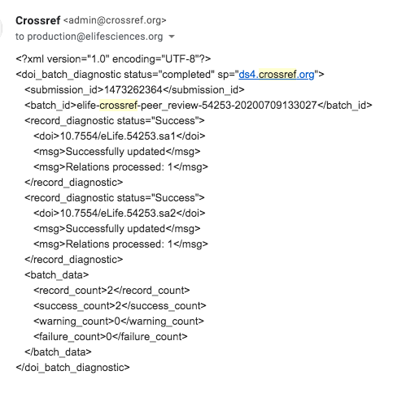

# Fixing Crossref/Dryad failures

## What is Crossref? 

Crossref is most commonly know for providing Digital Object Identifiers \(DOIs\) for research outputs making them easier to locate, cite, and more. DOIs allow the reader to follow a stable link straight to the content even when a website has changed. Each publisher will have their own ID in the DOI and this is followed by a slash and a string of numbers that are unique to the content. 

Here is an example of an eLife DOI: 10.7554/eLife.58603

At eLife, when an article is PoAed, the DOI is submitted automatically to Crossref and once processed, it will be registered with them. This is also triggered when a VOR article is ready for publication and sent to Continuum. If it has a date in the future ,say for press, the DOI will then be registered on the day of publication.  

## Crossref emails

Production receive Crossref emails for both PoA and VOR articles that are sent for publication on Continuum. 

 

## What to do when a failure occurs 

Outline the main things that need to be checked. Include a checklist if possible.

Examples

Give specific examples of everything that needs to be checked/any common problems. Add sub-sections where needed, but be as succinct as possible. Include screenshots as required.

This section should also list any issues that can be spotted without the need to run Schematron tests such as low figure quality, broken paragraphs, badly formatted tables etc. Crosscheck against the protocol documents in this folder.

Any quotes from articles should be formatted as quotes

Any Kriya queries should be formatted as a bullet point

Any hyperlinks to other pages or websites should be bolded to make sure they are more visible. 

Schematron checks

Content checks

List of errors and warnings that can occur, with guidance on how to solve each problem or on when it is OK to let the warning go by and not change anything.

These checks relate to the content of \[insert name of page\]. X or XXXXXX refers to quoted text which will change depending on the article.

id-x - make sure this is tagged as a level 3 header

Warning/Error/Info: content of message

Action: What to do if this message fires

XML structure checks

These checks relate to the XML structure of \[insert name of page\]. ‌X or XXXXXX refers to quoted text which will change depending on the article. For more information about what the XML should look like, see below \(include link to XML structure\).

id-x - make sure this is tagged as a level 3 header

Warning/Error/Info: content of message

Action: What to do if this message fires

XML structure

Include an example of the xml with variations if appropriate. 

Further reading

Where applicable, give links to related pages and external sites.

Changelog

After Exeter have fed back on the page and it has been updated, any further changes to the page should be listed in order from oldest to most recent.

dd/mm/yyyy

Changes

dd/mm/yyyy

Changes

