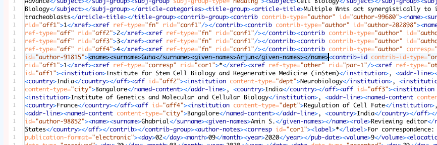
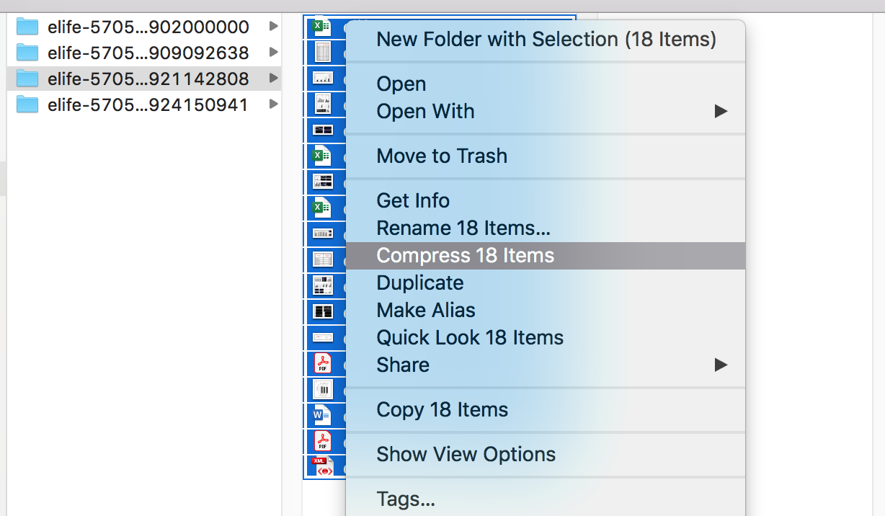

# Name change requests

## What does this page cover?

When an individual changes their name \(through marriage, by deed-poll, as a result of transitioning to another gender etc.\), they may wish to update their articles in the scientific record to ensure that their work can be found under their new name.

eLife aims to allow authors, reviewers and editors to update their names with a minimum of hassle.

## Editorial process

### Initial request

### Confirmation

### Editorial approval

## Production process

Once the name change request has been approved by the Editorial team, they will supply a list of the affected content to the Production team. It will be Production's responsibility to ensure that all versions of this content are updated with the individual's new name. This will cover the following:

* The current version of the article
* Any pending versions of the article \(VoR, new versions\) in the proofing system
* Any previously published versions \(PoA, VoR\)
* Any related content such as Insights, Corrections or co-submissions

### Updating the current version of the article

The current version of each affected article should be silently corrected following the normal process. The individual's name should be changed in the following places where applicable:

* Article metadata:
  * author list or peer review details
  * author contributions
  * competing interests
  * funding table \(should correct automatically\)
  * funding statement
  * data statement
* Article content:
  * acknowledgements
  * decision letter
  * author response

In cases where the individual's pronouns have changed in addition to their name, the following sections should be checked and updated if necessary:

* competing interests
* funding statement
* acknowledgments

For Insight articles and co-submissions, the following will also need to be corrected where applicable:

* key info box details for the related article \(in Insights\)
* mentions of the first author\(s\) in the text \(if applicable\)
* entry for related article in the reference list

If the article has been published as a Version of Record, the changes can be made in the proofing system following the normal silent correction process and once signed off, the updated article will overwrite the latest published version.

If the article has only been published as an accepted article, the PoA version should be silently corrected 

However, if there are any previous versions of the article on the system, these will still show the old name. Therefore, these need to be corrected as well.

### Updating a pending version of the article

If the Version of Record is still in production, 

### Extracting old versions from the archive

To identify previously published versions of the affected articles, go to the `elife-publishing-archive` bucket in the eLife Amazon Web Services \(AWS\). All versions of published eLife articles are stored here. If a user searches for a published article, they will see zip packages for each PoA and VoR version that has been issued.

To silently correct these, the first step is to download all package prior to the current \(latest\) version and note the full package names. These names will be required for loading to the silent correction bucket \(`prod-elife-silent-corrections`\) once all versions have been revised. So, for example, in the above case, there would be three packages to correct:

* 2 PoA versions
  * elife-57056-poa-v1-20200902000000.zip
  * elife-57056-poa-v2-20200909092638.zip
* 1 VoR versions
  * elife-57056-vor-v3-20200921142808.zip

In the event that a reviewer or senior editor name needs to be updated, only the version of record \(VoR\) packages will need to be edited. If, however, an author or reviewing editor name is to be changed, all versions will need to be corrected.

As [**above**](name-change-requests.md#updating-the-current-version-of-the-article), the affected name will need to be edited in all places it occurs in the article. 

* The XML will need to be updated manually to correct all occurrences of the author/reviewer name. This can be done in Oxygen by the Production team.

* PoA PDFs should be edited in Adobe by the Production team.

* VoR PDFs \(article PDF, figures PDF if affected\) will need to go to the content processor to be updated. The following is a suggested email template for requesting changes:

> REQUEST: Name change in previous versions of XXXXX  
>   
> Please update all occurrences Name One to Name Two in the attached PDF\(s\). The name appears in \[DELETE AS APPLICABLE\]:
>
> * author list/peer review details
> * author contributions
> * competing interests
> * funding table
> * funding statement
> * data statement
> * key info box
> * text "xxxxx . . . "
> * reference\(s\) XXXX et al., XXXX . . .
> * acknowledgements
> * decision letter
> * author response
>
> Please ensure that the corresponding initials are corrected where applicable.
>
> \[INCLUDE IF REQUIRED\] Please also correct the following instances of _Pronoun 1_ to _Pronoun 2_:
>
> * Text to be corrected
> * Text to be corrected
> * . . .

Once the XML and PDF files have been corrected, each version's ZIP package should be recreated and named using the exact same filename that was initially downloaded.

These should then be loaded into the silent correction bucket on the AWS.

It will take a few minutes for each online version\(s\) to update once the silent corrections have been uploaded. Any errors in processing the articles will appear on the Continuum dashboard as per normal.

### Downstream delivery

When the latest version of an article is silently corrected, the article will be redelivered to the following downstream endpoints, so these will be automatically updated with the new name:

* \*\*\*\*[**CrossRef**](https://www.crossref.org/) \(DOI registration\)
* \*\*\*\*[**PubMed Central**](https://www.ncbi.nlm.nih.gov/pmc/) \(full-text indexing service\)
* \*\*\*\*[**CLOCKSS**](https://clockss.org/) \(the dark archive used to preserve eLife publications in case the journal folds\)

The following endpoints will need to manually updated with the new name:

* [**PubMed**](https://www.ncbi.nlm.nih.gov/pubmed/management) \(abstract indexing service\)

Google Scholar ???

### Annotation to indicate a name change

Following an update to change an author, editor or reviewer's name, an annotation should be added to the latest version of the article to indicate that such a change has taken place.

> This article has been updated in response to a name-change request.

