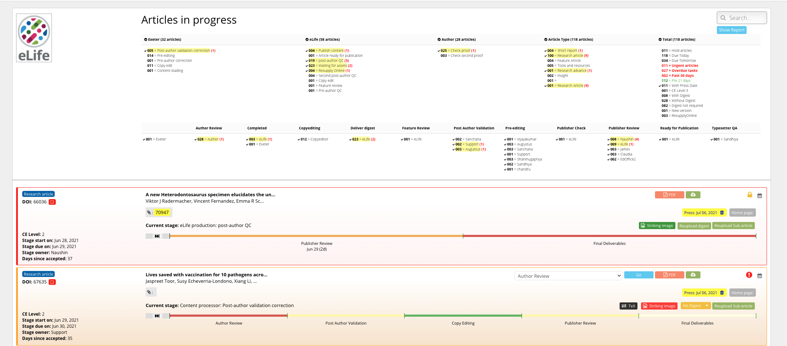
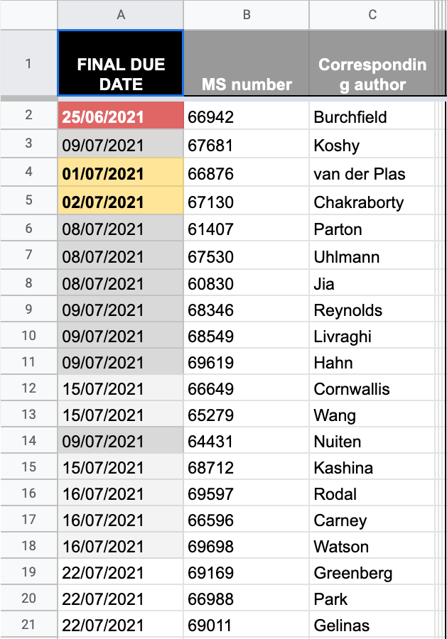

# Press processes

## What is press content? 

In the event that a paper has potentially broad public significance, authors may consider a press release. To coordinate this, they may discuss this with their institutional press officer and then get in touch with eLife directly, or they may be contacted by eLife's Press Officer, Emily Packer. Both PoA and VoR articles can be associated with a press release, which will be written prior to publication, either in-house at eLife, by a freelance writer or by the author's institution. Press articles at eLife are always scheduled for Tuesday publication and this content must be prioritised by both the content processors and the Production team. The Production team has a weekly meeting with Emily to schedule and to track the progress of upcoming press articles. 

## Press meetings 

Press meetings usually occur on a Thursday morning, and involve a member of the Production team meeting with eLife's Press Officer \(Emily Packer\). Before the meeting starts, the representative from Production needs to ensure that both Kriya 1 and Kriya 2 are refreshed and that they have the [digest tracker](https://docs.google.com/spreadsheets/d/17Llag-aEnbuARu5ORDJFki4K73xzy1fz2B2XG_QHQPI/edit#gid=1376331906) and [actions sheet](https://docs.google.com/document/d/1gWMKdmcl4i7EC_bHvrbpBcUKoXuMQ4WfrVDJ1HxQ0cc/edit?ts=56dd55b5) open in another tab. They should then run through all the articles marked as scheduled on the actions sheet, starting with the PoAs and then moving on to the VoRs. 

They should then move over to Kriya, where they should filter only for press articles. In Kriya 1, you do this by selecting 'With Press Date' under 'Total'.  They can then run through the articles in chronological order \(unfortunately, Kriya does not order them chronologically\). 

In Kriya 2, this can be done by selecting the list view and ticking 'Yes' under the 'Press release date' filter. 

When checking the status of press articles, if any of those marked for next Tuesday are still at the Author Review stage, they do not need to be pushed back at this point, and Emily can be updated on these in the [Press Update email](press-processes.md#press-update-email) on Monday. Emily will then enquire about the status of potential press articles. To come up with a press date, you can consult the due dates for each stage for each article by clicking the 'detailed' section on Kriya 1 \(the calendar icon the top right hand corner of the panel\).

If an article has been marked as getting a digest, you should refer to the [digest tracker](https://docs.google.com/spreadsheets/d/17Llag-aEnbuARu5ORDJFki4K73xzy1fz2B2XG_QHQPI/edit#gid=1376331906) which will give you a due date for the digest. 

If the article is due to reach Author Review on either a Monday or a Tuesday, then it can be scheduled for the nearest Tuesday. If it due to go out to the author later in the week, it should be scheduled for the following Tuesday. For instance, in the screenshot above, the proof goes out to the authors on a Wednesday \(7th July\), so should be scheduled for the Tuesday after next \(20th July\). If the article has not yet reached Kriya, Emily will make a note to check this in next week's meeting.

### Scheduling articles in Kriya 

Press articles can be marked in Kriya 2 by clicking on the relevant article and then the pen and paper icon next to 'Press Release Date'. You can then choose a date and time. You must specify whether this date is confirmed by selecting from the drop-down menu next to 'Confirmed'. 

On Kriya 1, press articles can be scheduled by clicking the press icon and choosing a date. A pop up will then prompt you to choose whether this date is confirmed. 

## Press correspondence 

### Press enquiries 

Emails that come into the Production inbox which relate to press content must be categorised as such using the 'press' Hiver tag. When authors enquire about press, Emily should be copied into the response using the template shown below. It is advisable to take the same course of action when an author enquires about a publication date, as often this means that they are considering press. You will need to provide Emily with an estimated publication date so she can propose a date to them. Emily will then follow up with the authors directly, and let you know when the press date has been confirmed. You can then schedule this on Kriya as outlined [above](press-processes.md#marking-articles-in-kriya). 

The Production team is also copied into emails from Emily to Editorial Office, asking them to put recently accepted articles on hold whilst she looks into potential press, or for them to be scheduled if she has decided on press. You can read more about how to process these emails [here](toolkit/managing-production-queries.md#press-emails). 

### Press update email 

On Mondays at around 3.30pm, the Production team sends an email to Emily, updating her on the status of the press articles for the next day. It is important that the person sending the email cross-checks the press articles listed under the relevant date on the [actions spreadsheet](https://docs.google.com/document/d/1gWMKdmcl4i7EC_bHvrbpBcUKoXuMQ4WfrVDJ1HxQ0cc/edit?ts=56dd55b5), with those listed on the [manuscript tracker](https://docs.google.com/spreadsheets/d/1TVgTAUijt9pVa_d8TRFcpPvipE31zcgBh0r9M5dFn4Q/edit#gid=2075183460) and those on [Continuum](https://prod--ppp-dash.elifesciences.org/current). These articles should appear under the ['Scheduled'](https://prod--ppp-dash.elifesciences.org/scheduled?view=list&start=30-06-2021&end=30-06-2022) section on the Continuum dashboard. 

As can be seen in the screenshot below, the email should clearly list all of the articles that have been scheduled, specifying the time and date and whether they have any related content such as an Insight. A press article will not be pushed back in the event that its related Insight is not ready. In the event that any articles need to be pushed back, this should be also indicated here, giving a clear reason for the delay so that Emily can inform the authors. 

If a press article has not yet been scheduled, but it is expected that it will still make the press date \(either it could be scheduled later on Monday or on the morning of the Tuesday\), Emily should be sent a second email at the end of the day updating her on its status. 

