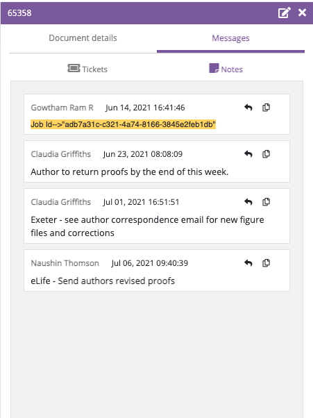
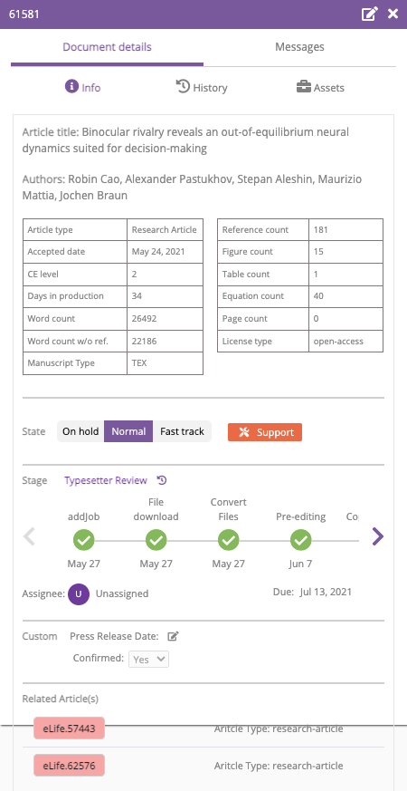

# Production Checklist

## Publisher Review 

Describe where this stage is situated within the publication process and then onto the messages tab 

### Checks prior to starting 

#### Notes 

Notes can be added by both production and the content processors. To view these on Kriya 2, click on the article in question on the dashboard, then on the 'messages' tab and then the 'notes' tab, as illustrated below. This is where the Production team can add any pieces of relevant information from their correspondence with the author, and where they can correspond with Exeter. It is important at Publisher review to check for any notes left previously have received a positive response and the correct action has been taken.

#### Emails 

In addition to checking an article’s history in notes, you must also check for any emails associated with it. Search the article reference number, look for the thread marked ‘Author Correspondence’, and check for any issues. 

**Press** 

You will also want to check whether the article is marked for press. This will be indicated in the 'custom' section, under the 'document details' and 'info' tabs. These articles should be prioritised and the press date noted and inputted upon publisher review.  

#### Linked articles 

Some articles will be linked to other articles, indicating that they might need to be published together. If there is one or more linked article, they will be displayed in the 'related articles' section, under the 'document details' and 'info' tabs. Under 'article type', you can see what kind of related article it is: ‘commentary’ means it is an Insight; ‘related article’ means it is just another article. The colour of the label indicates its progress through the system. 

### Assigning articles 

In order to 

### Article details checks 

#### Title 

* Check that the title makes sense.
* Only italic formatting is allowed.
* Check that it avoids unexplained acronyms. 
* For latin words, the general rule is that genes, bacteria and species such as ‘S. pombe’ should be italicised, and that phrases such as ‘in vivo’ or ‘in vitro’ should not be italicised. However continuity between the title, impact statement and article content is most important, so please check that italics are consistent.

#### Authors 

#### Affiliations 

#### Editors and reviewers 

