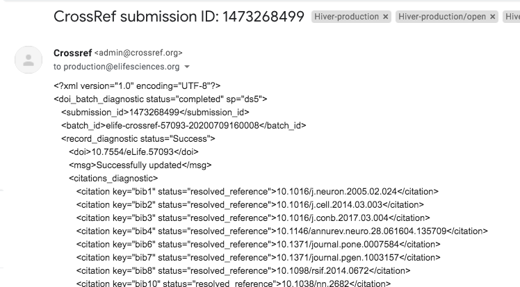
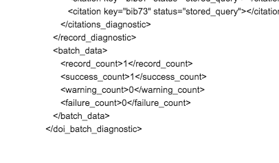

# Fixing Crossref/Dryad failures

## What is Crossref? 

Crossref is most commonly known for providing Digital Object Identifiers \(DOIs\) for research outputs, making them easier to locate and cite. DOIs allow the reader to follow a stable link straight to the content even when a website has changed. Crossref DOIs begin with '10.', followed by a publisher's unique 4 digit number and a slash \(eLife's is 7554/\). Following that each publisher assigns a unique set of characters to each DOI they publish, eLife uses eLife.XXXXX where XXXXX is the manuscript number assigned to an article in eJP. For example: 10.7554/eLife.58603.

When an article is published in accepted manuscript form \(PoA\), the DOI is submitted automatically to Crossref and, once processed, it will be registered. This process is also triggered when a VoR article is sent to Continuum. If the article has been PoA'd, the metadata deposited with Crossref is enhanced with the full-text information available from the final VoR publication. Each time an article is published the metadata is sent to Crossref so any mistakes are overwritten and any additional information published is added to the Crossref record. When content is sent to Continuum with a future date, for instance press content, the DOI will be registered at midnight the day before publication. 

## Crossref emails

Production receives Crossref emails for both PoA and VOR articles that are sent for publication on Continuum. 

These typically look like this: 

Each email needs to be checked to ensure there have been no failures. At the bottom of the email, you should look at the following section: 

If any failures are listed, you will need to check the rest of the content of the email \(above\), which will outline where the failure has occurred.

When sending VoR content metadata to Crossref we list all citations within the article. In the case above, the DOI for the Dryad dataset that was referenced in the article was not live yet when we sent the metadata to Crossref. As the Dryad DOIs are minted by Crossref too, their system automatically checks whether the cited DOI exists in their system and if it does not, fails our submission. This is one of our most common failures. It is a Catch-22, Dryad do not release datasets to view and hence register their DOIs until the article which they are about is published. We submit Crossref metadata just before publication. If the article has been PoA'd we have not sent the citation details to Crossref so Dryad can know the article their dataset is linked to is published.

## What to do when a failure occurs 

To correct these failures, you must first set up the transformation scenario \(this only needs to be done once\) in oXygen \(an XML editor\).

1. Download the zip below, unzip it \(inside should be a file called `crossref.xsl`\) and place it somewhere on your local machine such as your desktop.



2. Open any XML file in oXygen.

3. In oXygen's top toolbar, click configure transformation Scenarios \(or press cmd + shift + t\).

4. Click 'New' -&gt; XML transformation with XSLT.

5. Rename the scenario something appropriate, like crossref.

6. Click the folder for XSL URL, and navigate to where your local version of crossref.xsl was placed.

7. Click 'Output'.

8. Click 'Save as', and in the field next to it paste the following: `elife-crossref-${xpath_eval(substring-after(doc('${rootMapURL}')//publisher_item/item_number[@item_number_type="article_number"]/text(),'e'))}-${xpath_eval(format-dateTime(current-dateTime() + xs:dayTimeDuration('PT30M'), '[Y0001][M01][D01][H01][m01][s01]'))}.xml`

9. Click 'OK', and then Click 'Save and close'

Now this has been set up, you can correct failures in the blink of an eye but first, you must download the XML.  

## Downloading the XML from Crossref

* Go to the Crossref admin page: [**https://doi.crossref.org/servlet/useragent?func=showHome**](https://doi.crossref.org/servlet/useragent?func=showHome) ****and log in \(please ask Production for these credentials\). 
* Select ‘Submission administration’.
* Search for the DOI number with no restrictions, which will bring up the list of submissions processed by Crossref. Recent errors will be highlighted with a red ‘E’ symbol:

* Locate the article that has failed.
* Right/ctrl click on the file icon to the right of the ID \(blue text\) and click ‘Save link as’. When you download a file it automatically downloads with the filename `submissionAdmin.xml`. 
* Now open the XML file using your XML editor, such as Oxygen.
* In the top toolbar, click configure transformation Scenarios \(or press cmd + shift + t\).
* Tick the scenario you setup \(see [**above**](fixing-crossref-dryad-failures.md#what-to-do-when-a-failure-occurs)\).
* Click 'Apply associated \(1\)'.

This process will remove the failure and create a new XML file.

**Pro tip:** Next time, you only have to press cmd + shift + t and it will do the work for you 🕺 

**Now navigate back to Crossref to complete the following:** 

* Return to the admin page and select the 'Upload' tab.
* Select the corrected XML file and click the 'upload' icon. 

* Go back to the admin page and search without restriction to bring up the whole queue again, it should now be at the top. Be aware that the old failure will still remain.
* Look out for the success Crossref email to come through. 

This has now been resolved. Unfortunately, this does mean that the citation to the Dryad dataset will not be registered with Crossref but a manual workaround is not desirable.

