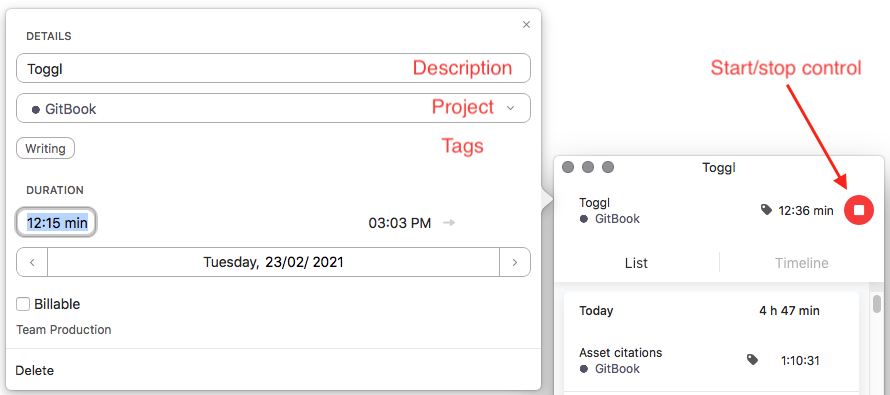
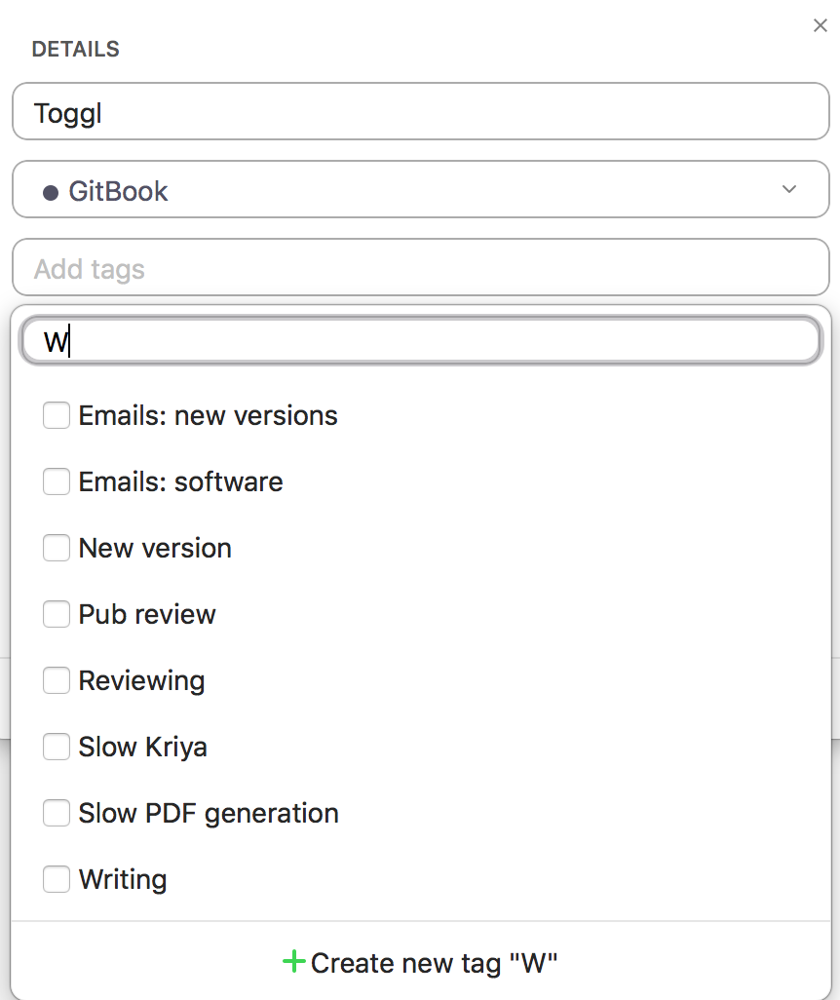

# Toggl

## What is Toggl?

[**Toggl track**](https://toggl.com/) is a time-tracking application that the eLife production team uses to monitor how much time is spent on different tasks. This information will be used to monitor the effect of changes to workflows, to track the distribution of work compared to article volumes, to double-check the team has time to work on projects outside the day-to-day tasks, and so on.

The Toggl interface works on self-reporting, with the user required to start and stop the time like a stop-watch. The user can add a manual description of the task, assign it to a preset ‘project’ and add one or more preset tags.

## Projects and tags

A preset list of projects is maintained to account for standard production tasks. These can be edited within the Toggl browser interface at [**https://track.toggl.com/projects/**](https://track.toggl.com/projects/). When beginning or editing a task in the desktop application, the project can be set 

Tags can be appended to the task as well. Multiple tags are permitted per task, but most of the preset tags are intended for use with specific projects.

The following is a full list of projects and the associated tags currently in use by the production team.

<table>
  <thead>
    <tr>
      <th style="text-align:left">Project</th>
      <th style="text-align:left">What&apos;s it for?</th>
      <th style="text-align:left">Associated tags</th>
    </tr>
  </thead>
  <tbody>
    <tr>
      <td style="text-align:left">Continuum Checks</td>
      <td style="text-align:left">Tracking pre-publication checks on Continuum, equates to &apos;preview&apos;
        in TaskAdept</td>
      <td style="text-align:left">New version</td>
    </tr>
    <tr>
      <td style="text-align:left">Emails</td>
      <td style="text-align:left">Tracking time spent on emails</td>
      <td style="text-align:left">
        
Emails: author details

        
Emails: datasets

        
Emails: figures

        
Emails: math

        
Emails: morning

        
Emails: press

        
Emails: proof access

        
Emails: proof edits

        
Emails: proof return delay

        
Emails: Pub date query

        
Emails: reproducibility

        
Emails: software

        
Emails: striking images

        
Emails: typesetting

        
New version

      </td>
    </tr>
    <tr>
      <td style="text-align:left">ERA</td>
      <td style="text-align:left">Tracking time spent on executable research articles</td>
      <td style="text-align:left"></td>
    </tr>
    <tr>
      <td style="text-align:left">GitBook</td>
      <td style="text-align:left">Tracking time spent on the production Gitbook</td>
      <td style="text-align:left">
        
Reviewing

        
Updating

        
Writing

      </td>
    </tr>
    <tr>
      <td style="text-align:left">GitLab</td>
      <td style="text-align:left">Tracking time spent on GitLab tickets e.g. production vendor bugs</td>
      <td
      style="text-align:left"></td>
    </tr>
    <tr>
      <td style="text-align:left">Home page</td>
      <td style="text-align:left">Tracking time spent updating the home-page</td>
      <td style="text-align:left"></td>
    </tr>
    <tr>
      <td style="text-align:left">JATS4R</td>
      <td style="text-align:left">Tracking time spent on the JATS For Reuse project</td>
      <td style="text-align:left"></td>
    </tr>
    <tr>
      <td style="text-align:left">Kriya - dashboard</td>
      <td style="text-align:left">Tracking time spent on the Kriya dashboard, refreshing, assigning articles
        etc.</td>
      <td style="text-align:left"></td>
    </tr>
    <tr>
      <td style="text-align:left">Libero Editor</td>
      <td style="text-align:left">Tracking time spent working on the Libero Editor project</td>
      <td style="text-align:left"></td>
    </tr>
    <tr>
      <td style="text-align:left">Meetings</td>
      <td style="text-align:left">Tracking time spent in meeting, huddles etc</td>
      <td style="text-align:left"></td>
    </tr>
    <tr>
      <td style="text-align:left">Misc</td>
      <td style="text-align:left">Tracking time spent on tasks not covered in other projects</td>
      <td style="text-align:left"></td>
    </tr>
    <tr>
      <td style="text-align:left">PoA</td>
      <td style="text-align:left">Tracking time spent working on Publish on Accept content</td>
      <td style="text-align:left">New version</td>
    </tr>
    <tr>
      <td style="text-align:left">PRC</td>
      <td style="text-align:left">Tracking time spent on the Publish, Review, Curate project (Sciety)</td>
      <td
      style="text-align:left"></td>
    </tr>
    <tr>
      <td style="text-align:left">Pub Check</td>
      <td style="text-align:left">Tracking pre-author checks in Kriya, article number in description</td>
      <td
      style="text-align:left"></td>
    </tr>
    <tr>
      <td style="text-align:left">Pub Review</td>
      <td style="text-align:left">Tracking post-author checks in Kriya, article number in description</td>
      <td
      style="text-align:left">New version</td>
    </tr>
    <tr>
      <td style="text-align:left">Reporting</td>
      <td style="text-align:left">Tracking time spent on reporting and data tasks</td>
      <td style="text-align:left"></td>
    </tr>
    <tr>
      <td style="text-align:left">Schematron</td>
      <td style="text-align:left">Tracking time spent working on the schematron tests</td>
      <td style="text-align:left"></td>
    </tr>
    <tr>
      <td style="text-align:left">Slack</td>
      <td style="text-align:left">Tracking time spent in Slack, assisting others, asking questions,</td>
      <td
      style="text-align:left">New version</td>
    </tr>
    <tr>
      <td style="text-align:left">Training</td>
      <td style="text-align:left">Tracking time spent training other members of the team</td>
      <td style="text-align:left"></td>
    </tr>
  </tbody>
</table>

### **Continuum Checks**

As with the pub checks and reviews, we also track how long a Continuum check may take. 

### **Emails** 

When handling emails, you should always use the ‘Emails’ project unless they are related to striking images which should then go under the ‘Home page image/striking images’ project.

If you are just looking at/closing standard emails \(such as Crossref emails, Exeter delivery updates etc\), you can track this under the ‘Emails’ project and leave the description blank or type ‘Emails’ into this.

We like to track how long emails take for particular articles so if you are replying to the authors, please add the manuscript number to the description field e.g. 58556.

### ERA

### GitBook

### GitLab

### Home page

### JATS4R

### Kriya - dashboard

To help us monitor the performance of the Kriya dashboard, it is helpful to track the time it takes to refresh the page or when assigning the articles to yourself.

### Libero Editor

### Meetings

It is useful to track our meetings too, somethings these can overrun and it's easy to wonder where the day went!

### Misc

### PoA

### **Pub check**

\*\*\*\*

### **Pub review**

We have these as separate projects so that we can monitor how long it takes to complete the pub check or pub review. This should be tracked from when you open the proof to when you sign off out of the proof. For Toggl, you should add the article number to the description.

### Reporting

### Slack

If you are just using slack \(such as answering a query from Exeter or chatting to the Production team\), this should be tracked using the ‘Slack’ project. You do not need to add a description for this.

### **Training**

Unfortunately we are unable to track training that you may receive at the same time as another project \(such as being talked through an issue within your pub review\) so we have a training project for time that is solely dedicated to a training session.

