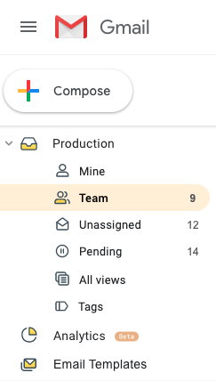
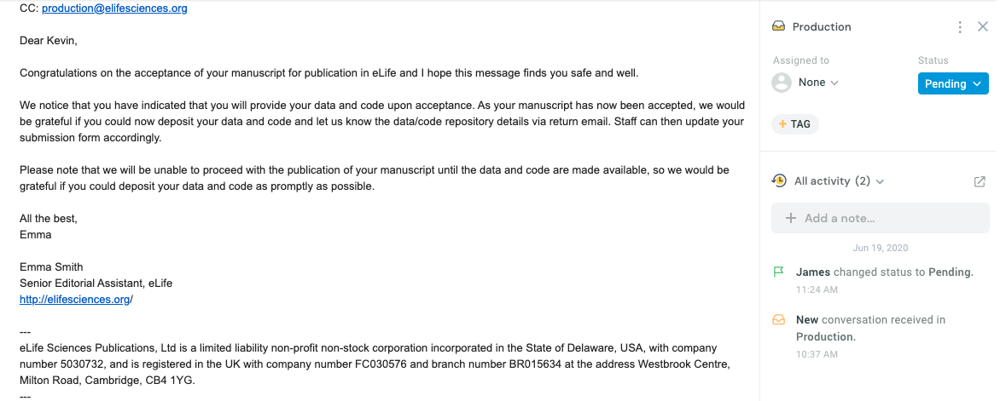
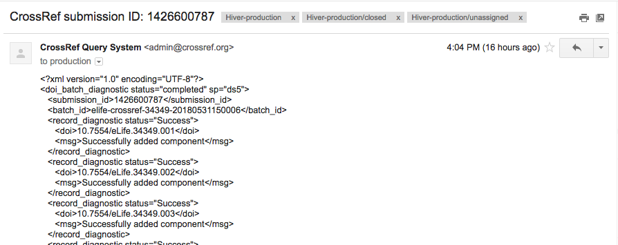
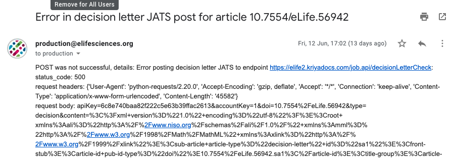
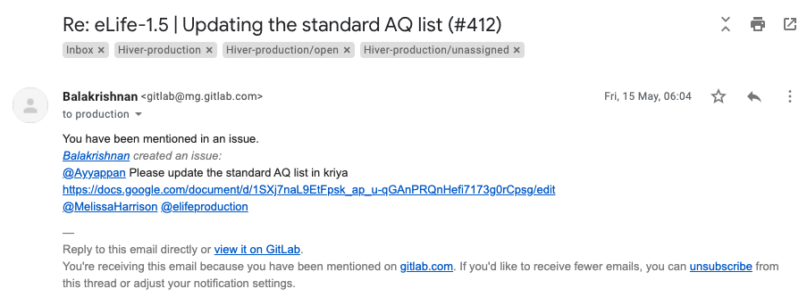
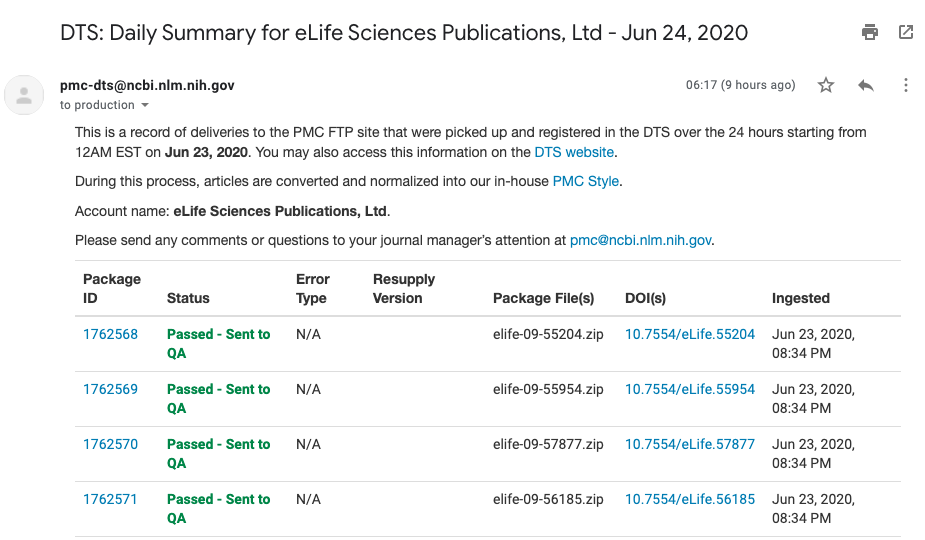
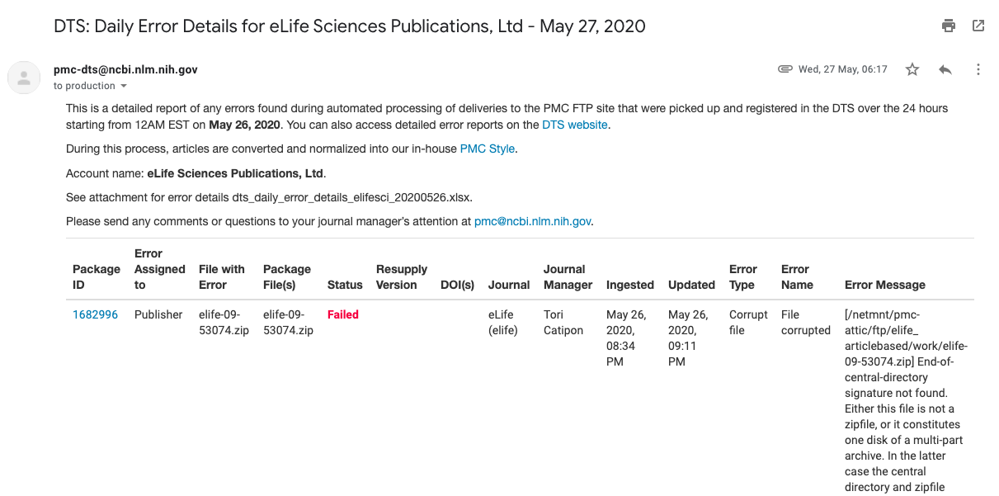
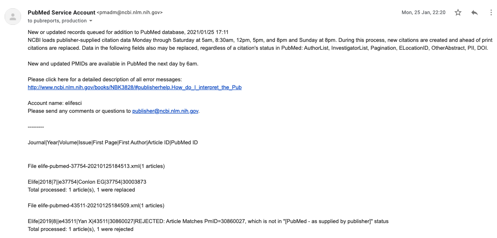
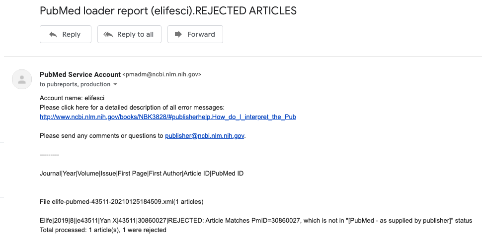

# Managing production queries


For changelog, click [**here**](managing-production-queries.md#changelog). Updated 22/03/2021


## Production q**ueries**

The Production team receives daily queries from a variety of sources including external vendors, other eLife teams, and authors. Author queries arrive as emails, but we receive emails and use Slack for liaising with other eLife teams and some vendors \(e.g. Exeter and Editorial Office\). It is important to respond to these queries in a timely manner to prevent articles being held up unnecessarily. Production staff are responsible for responding to these messages throughout the day, ideally as soon as possible without breaking the flow of other tasks. The first task in the mornings is to address emails that have arrived overnight. 


* Emails from authors should be replied to within the same day \(unless they arrive after 4PM\), even if only with a note to say we are looking into the query and will respond with a resolution when it is available. Pre-publication author correspondence emails should be prioritised above other emails and production tasks. See more about interacting with authors [**here**](interacting-with-authors.md). 
* Slack queries and emails from our typesetters should be replied to as quickly as possible within the same day to prevent holding up articles.


## **Using Hiver**

The Production inbox is a shared inbox that everyone in the team has access to. We manage this using a collaboration tool called a Google Chrome plugin called Hiver \(download [**here**](https://hiverhq.com/)\). Hiver allows us to clearly divide up the workload by assigning emails to ourselves. It also allows us to categorise and track the types of emails we get by adding tags. When an email needs responding to it is ‘open’, when resolved it can be closed. An email can also be marked ‘pending’ if further action is needed, or its progress needs to be tracked. 

The Hiver inbox can be seen on the left sidebar in Gmail. In the drop-down menu, you can view emails assigned to yourself/the rest of the team, as well as emails that have yet to be assigned, and pending emails. 

  

### **Assigning emails**

General queries in the inbox can be replied to without assigning the email to yourself. However, if you are corresponding with an author about an article you are working on, it is useful to assign the email to yourself. 

To do this from the inbox, select the email and click on theicon. Then click on 'Select a user' and choose a name from the drop-down menu. 

You can also assign an email by opening the email and going to the Hiver toolbox on the right-hand side of the email. If this is not visible, click on the Hiver icon on the top-right Click on the 'Assigned to' drop-down menu.

The email will then be tagged with that user’s name and moved to their inbox. The rest of the team can still search for and access the email, however they will not be notified of any correspondence in that thread until it is unassigned and moved back to the general inbox.

### **Changing the status of an email**

Similar to assigning emails, you can change the status of an email by selecting it in the main inbox view and clicking on the icon. This can also be done by opening the email and using the Hiver toolbox as before.

If an email requires no response or has been resolved it should be closed. You can also change the status of an email when replying to it. Click on the 'Send & Close' button to close the email after the reply has been sent, or choose one of the other options from this button. Use the 'Send & Close & Unassign' if you want to close an email that was assigned to you, and need any subsequent replies to go into the main inbox.

'Pending' status should be used for emails that are waiting on further action from others, or need to be watched. For example, if editorial have CCd us into a request for data or code, these emails can be marked as pending until the author has responded or the article is published.

If the authors have contacted production directly, you should still reply to authors to keep them in the loop, even if only to let them know that we are looking into an issue. Marking an email as 'pending' moves it to the pending section of the inbox. This section should be reviewed weekly and emails here should followed up on as appropriate. If we receive replies to 'pending' emails, these emails will automatically be re-opened and be available in the main inbox \(or if the email was assigned to a team member, it will be available in their inbox\).

### Adding notes to emails

You can view an email’s history, and any notes that have been added to it \(as well as adding your own\) in the Hiver toolbox when you open an email. If there are particular points to be aware of in relation to an article, it is useful to add and pin this note and colour it red to help the team see this at a glance. If the email is just for the Production team's information, add a 'Read' note so we know when the whole team has read the email \(the last person to add the note can then close the email\).

### **Hiver tags**

Hiver tags help us to categorise our emails, and to keep track of what we receive. Similar to assigning emails, you can add tags to an email by selecting it in the main inbox view and clicking on the icon. You can also do this after you have opened an email:

When tags are added, they appear at the top of the email and also in the quick view. Each tag has a different colour, and you can add as many tags as needed. For example, in the screenshot below, emails containing tags for assigned users, New versions, Author correspondence and Author complaint:

Our tags:

* Author Complaint - for any negative emails/complaints from unhappy authors.
* Author Compliment - for any complimentary emails from happy authors.
* Author Correspondence - for any and all emails from authors.
* eLife Query - for queries sent to us from Exeter.
* Exeter Delivery - for the delivery note we receive from Exeter every morning.
* Exeter Problem - for any problem emails we send to Exeter.
* Exeter Question - for any questions/requests we ask of Exeter.
* Failure - for any Crossref/PMC/POA failures.
* Features - for all correspondence regarding feature content.
* Press - for any press-related emails.
* New versions - for any published articles that need to be corrected \(PoA and VoR\).
* TNQ Correction - for any emails about articles requiring a TNQ correction \(correction for any articles published before November 2015 with our previous typesetters\).
* Huddle -  for flagging any emails that you want to discuss in that day's huddle meeting \(10.30 AM\).
  * Use this tag if you are clearing the inbox in the morning and you come across an email that requires further discussion with the team before a response. If you come across such an email after the huddle, this should be queried with the Production team in Slack rather than being tagged for discussion the following day.

### Exeter prefixes

Emails we send to Exeter should also be prefixed to help them categorise and filter emails at their end:

* AUTHOR CORRESPONDENCE: This is for author emails we forward on to Exeter which contain changes that they should make during the Post-author validation stage.
* PROBLEM: This is for when we encounter any issues using Kriya, or on articles that we cannot solve at our end
* REQUEST: For any requests, such as asking Exeter to manually move an article between stages
* PRAISE: For providing any positive feedback, or forwarding on any complimentary author emails

You can see in the screenshots below how emails have both the subject prefix \(for Exeter’s use\), and the Hiver tag \(for ours\).

## **Email types**

There are many types of email that we receive on a regular basis. Many of these are automated and require a particular action each time. For more information about how to reply to common author emails, see [**here**](interacting-with-authors.md).

### **Crossref emails**

Crossref, the DOI registration agency, processes all of our DOIs and sub-DOIs when an article is sent to continuum. They then send us a report.

Scroll to the last 6 lines of the report. If there is anything in the ‘failure\_count’ then action is needed \(if there is anything in ‘warning\_count’ this can usually be ignored\). If all are zeros then it can be closed as all DOIs have successfully processed and registered.

\(See ‘[**Crossref/Dryad failure protocol**’](https://docs.google.com/document/d/1TW71S4AIILFIknkXYz1Gxlxw5OJg8ycuivyVYkgyknE/edit) for instructions on resolving one of the common failures we get.\)

Every now and then we also get emails from Crossref to let us know about scheduled maintenance. These can just be closed. If they email to let us know their server is down, this email can be kept open for the duration of the outage so everyone on the team is aware of this.

### **Decision letter loading**

When the Editorial team uploads a decision letter via the decision letter API, we receive an email. 

Wait five minutes or so and then check the decision letter has loaded on the Kriya dashboard.

If the decision letter has loaded, this email can be closed. If the article is not yet in Kriya, this email should be left open until it is \(add a note to the email using Hiver\).

We may get error emails if decision letters fail to load:

There are numerous possible reason why a decision letter might have failed to load. See [**here**](../article-details/content/decision-letters-and-author-responses.md#the-decision-letter-was-not-posted-successfully) for more details.

### **Digest loading**

Similarly, we receive emails when a digest is uploaded to an article by the Features team.

Just as before, these also need to be checked on Kriya five minutes after we receive the email before closing.

If a digest hasn't loaded, this is usually because Kriya is down \(or the article hasn't yet been loaded, but this is much less likely\). When Kriya is running again, or when the article has loaded, the Production team will need to ask the Features team to re-upload the digest to the AWS bucket. Digests may also not load because there is a problem with the files or parser - in this case, we'll need to raise a GitHub issue for Graham to investigate.

### GitHub/GitLab emails

The production team uses GitHub and GitLab to collaborate with other teams. When issues we are assigned to receive replies or when we are mentioned in issues, we receive emails to notify us. You can reply to these in GitHub or GitLab \(depending on which platform was used\). If you are unsure of what to do in response to the email, raise this in the daily Huddle meeting.

### **No-digest emails**

Every week \(usually on Wednesday or Thursday\), the Features team sends us a list of the latest articles that are not getting digests. 

They will have already marked them as ‘no-digest’ articles in Kriya, however we need to double check all of them to ensure that the labels have stuck because Kriya 1 can be unstable. We also need to check and update the [**decision letter tracking spreadsheet**](https://docs.google.com/spreadsheets/d/1oy8TIwsedSYdy6n3_SFuqUcJ4Ljeg7tXnTS6q2CsNI8/edit?ts=57fe457c#gid=0) at the same time. 

Search for each article from the email and add a 'No digest' status to any articles that haven't had the label stick. If an article has been sent to the 'Waiting for assets' queue and has had its decision letter loaded, marking it as 'no-digest' will send it straight to the authors for proofing. 

If the article is still waiting for its decision letter to be loaded, the [**decision letter tracking spreadsheet**](https://docs.google.com/spreadsheets/d/1oy8TIwsedSYdy6n3_SFuqUcJ4Ljeg7tXnTS6q2CsNI8/edit?ts=57fe457c#gid=0) will need to be updated so the Editorial Office team knows which decision letters should be prioritised. Search for the manuscript number and in the 'Notes' column, add the text 'No digest'. This should be done for all articles on the no-digest list, including any that are not yet in Kriya. 

If the article is not yet in Kriya, add it to the [**Production actions sheet**](https://docs.google.com/document/d/1gWMKdmcl4i7EC_bHvrbpBcUKoXuMQ4WfrVDJ1HxQ0cc/edit?ts=56dd55b5) under the 'CONFIRMED NO DIGEST BUT NOT YET IN KRIYA' heading and update the 'last checked' date. This section of the sheet should be checked every day and once the article has loaded to Kriya, it should be marked as 'No digest'.

Note, the decision letter tracker has a 'hold for export' section. This is for articles that are currently on hold with the Editorial Office \(usually waiting for some additional information e.g about data availability\). Articles in this section should still be marked as 'No digest' if relevant. 

### **Out of office responses**

We may receive 'out of office' response to the automatic proofing emails that are sent to authors. If the author is only out of office for a few days, these emails can be closed. If the author is on sabbatical, forward the proofing email to the other corresponding authors if there are any, or to the first author and cc in the author on sabbatical to check whether they will be able to review the proofs. If they will not, we may need to ask Exeter to manually move the proofs in house once the other authors have finished reviewing the proofs.

### **PMC failures**

We receive a daily summary from PMC about articles we have sent to them in the last 24 hours. If the status of each package is 'Passed-Sent to QA', this email can be closed.

If the status of any of the packages indicates a failure, this will need to be investigated**:**

The error message \(on the right in the email screenshot above\) will provide information on what kind of problem has caused the failure. The most common failure is that PMC's system often tries to parse gif \(animation\) files as XML files. You will be able to determine that this is cause if the error message refers to a gif file \(or files\) and refers to the fact that they do not contain a doctype declaration \(or similar\). If this is the case, then you should reply to the email asking for PMC to look into the problem \(as it is a problem on their end\). If the error message suggests that the article XML file is DTD invalid, then you can check this by downloading the XML file \(from the appropriate AWS bucket, e.g. elife-production-final\) and validating it against the DTD. If it fails DTD validation, then this will need to fixed by Exeter as a silent correction. If you are unsure about the cause of the failure then it should be brought up in the daily huddle.

In the example screenshot above, only a partial or corrupted zip package was delivered to the PMC FTP, due to some downtime in the bot processes. The appropriate action would have been to raise a GitHub ticket so that an eLife developer can ensure that the zip package is delivered in full to PMC.

### **PoA package emails - success and failure**

We receive success or failure notifications for all articles that are scheduled for publication as PoAs by the bot. Every day, a member of the production team will handle these emails. The Editorial Office will let us know if any articles need to be reloaded or if the published dates need to be updated. If there is a failure, it will need action. We will also receive a 'PublishFinalPOA Success!' email when the PoAs have been loaded to Continuum. This email can be closed. See [**Publish on Accept protocols**](../pages-in-progress/publish-on-accept-protocols.md) for more information about the PoA process.

### **Post-acceptance check completed**

This is an automatic email that notifies us when the post-acceptance check has been completed by Editorial Office. This can be closed.

### **Press emails**

Our Press Officer Emily will sometimes email us to ask about publication dates. Often she will cc in Editorial and Features, if the article’s progress is dependent upon post-acceptance checks or a digest. 

Emily will also cc us in if she asks Sue at Editorial Office to put any recently accepted papers on hold, whilst she looks into potential press for them. 

A 'Press' tag should be added to these emails. The initial request email \(and hold confirmation response from Editorial Office\) can just be closed. Once Emily decides a PoA article is getting press, she will ask Editorial Office to schedule the article and CC us in. 

At this point, the manuscript number should be added to the [**Production team actions sheet**](https://docs.google.com/document/d/1gWMKdmcl4i7EC_bHvrbpBcUKoXuMQ4WfrVDJ1HxQ0cc/edit?ts=56dd55b5) under the relevant press date section. The email can be closed once this is done. 

When Editorial Office confirm an article has been scheduled, double-check it appears under the 'Scheduled' section on the [**Continuum dashboard**](https://prod--ppp-dash.elifesciences.org/current)**.** 

The green 'Scheduled' note can then be added on the Production team actions sheet and the email closed once more. 

### **Proofing emails and chasers**

Authors receive emails when their proofs are ready to review, and we are cc'd into these. These emails can just be closed. Often the authors will respond to this email with any issues they have, at which point the ‘Author correspondence’ tag would be added, and a response would be required.

Similarly, authors receive another email when their proof is overdue, one at 2 days, and one at 4 days. We are cc'd into these so we can keep track of the progress of the proofs. These can be closed.

If the proof is still not submitted, we will receive an email asking us to chase the authors manually. Always check that the author has not been in touch before chasing them. If someone is already corresponding with them, then the email can be closed. If not, send a manual chaser email \(there is a [**Hiver template**](interacting-with-authors.md#chaser) for this as well as one for use [**specifically during COVID**](interacting-with-authors.md#covid-chaser)\) and copy in all corresponding authors. If the authors do not reply within 2 working days, first authors should be copied into follow-up chaser emails.

### **PubMed loader report**

Throughout the day we will also receive automated emails when articles are loaded to PubMed \(see [**Pubmed and PMC protcols**](https://docs.google.com/document/d/1nngNI8tmRMgzOBqgO_s-w3dmCEjmwo6iTYjZr1HM5VQ/edit)\). These emails can be closed.

If any articles have been rejected from PubMed, these will be listed in the loader report summary email and in a separate 'REJECTED ARTICLES' email. 

This will need to be investigated further so add the 'Failure' and 'Huddle' tags and raise this in the daily Huddle meeting. The loader report email can be closed, but keep the REJECTED ARTICLES email open until this has been discussed and resolved. 

### **Striking images**

Authors will often email us with their ‘Striking images’ to be uploaded. Striking images are images that may be used for the eLife homepage or social media channels. [**See here**](striking-images-1.md#uploading-a-striking-image) for how to add striking images to articles. Authors may also refer to these as 'promotional images' or 'graphical abstracts'.

### **Video processing**

Every time an article with videos is sent to Continuum, we receive a processing report from Glencoe, our video hosting site. If all videos are listed underneath the ‘succeeded’ heading, this email can be closed. If any are listed under ‘failed’ this will need to be investigated with Exeter and/or Glencoe.

### **XML notification emails**

This email notifies us that articles have been exported from eJP. If they have an ‘0’ on the end, they relate to articles being exported for PoA. These can be closed. If they don’t, they relate to articles being loaded into Kriya. We need to check that it has loaded correctly before closing.

## Changelog

After Exeter has fed back on the page and it has been updated, any further changes to the page should be listed in order from oldest to most recent.

### 08/03/2021

#### Changes

* Added information about the huddle tag.
* Added [**Production queries**](managing-production-queries.md#production-queries) section.
* Added to [**Adding notes to emails**](managing-production-queries.md#adding-notes-to-emails) section.

### 22/03/2021

* Made some edits to various sections after Production team feedback. 

### 29/03/2021

* Added some additional info \(colouring notes in Hiver, pubmed loader failure emails\).

