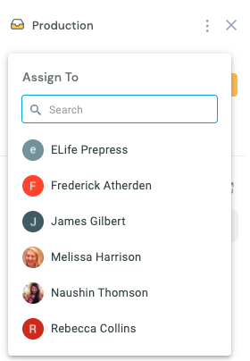
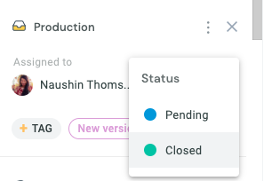
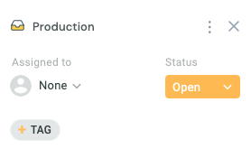
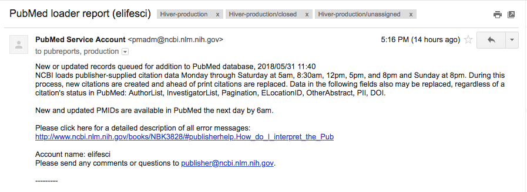
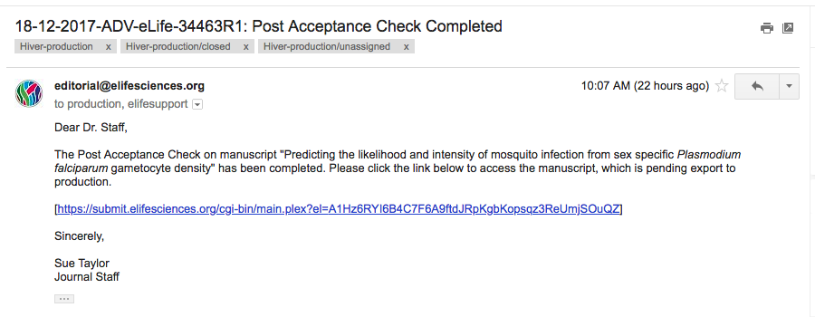
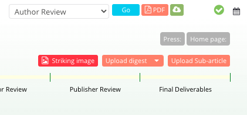

# Managing the production inbox

## **Using Hiver**

The Production inbox is a shared inbox that everyone in the department has access to. We manage this inbox using a collaboration tool called Hiver. Hiver allows us to clearly divide up the workload by assigning emails to ourselves. It also allows us to categorise and track the types of emails we get by adding tags. When an email needs responding to it is ‘open’, when resolved it can be closed. Emails can also be marked ‘pending’ if further action may be needed, or its progress needs to be tracked.

### **Assigning emails**

Assign an email by navigating to the Hiver toolbox on the right-hand side of the email. Select a name from the dropdown menu.

The email will then be tagged with that user’s name and moved to their inbox.

### **Changing the status of an email**

If no action is required, or the email is resolved, it can be closed by selecting from the second drop down menu, and selecting ‘closed’.

‘Pending’ status can be used for emails that you want to come back to later, or to keep an eye on. Marking an email as 'pending' moves it to a separate section of the inbox.

You can view an email’s history, and any notes that have been added to it \(as well as adding your own\) in the activity bar beneath this:

### **Tags and prefixes**

Hiver tags help us to categorise our emails, and to keep track of what we receive. Add a tag by clicking the ‘+ TAG’ button in the bottom-left corner of the Hiver toolbox:

When tags are added, they appear in the inbox attached to the email. Each tag has a different colour, and you can add as many tags as needed.

For example, see in this screenshot, emails containing tags for assigned users, New versions, Author correspondence and Author complaint:

Our tags:

* Author Complaint - for any negative emails/complaints from unhappy authors
* Author Compliment - for any complimentary emails from happy authors
* Author Correspondence - for any and all emails from authors
* eLife Query - for queries sent to us from Exeter
* Exeter Delivery - for the delivery note we receive from Exeter every morning
* Exeter Problem - for any problem emails we send to Exeter
* Exeter Question - for any questions/requests we ask of Exeter
* Failure - for any CrossRef/PMC/POA failures
* Features - for all correspondence regarding feature content
* Press - for any press-related emails
* TNQ Correction - for any emails about articles requiring a TNQ correction \(correction for any articles published before November 2015\)

Some of these correspond to the subject prefixes which we add for emails sent to Exeter to help them categorise and filter them at their end:

* Author Correspondence: This is for author emails we forward on to Exeter which contain changes that they should make during the Post-author validation stage.
* Problem: This is for when we encounter any issues using Kriya, or on articles that we cannot solve at our end
* Request: For any requests, such as asking them to manually move an article between stages
* Praise: For providing any positive feedback, or forwarding on any complimentary author emails
* eLife Query: For any questions that they ask us. Sometimes these questions will be asked in Slack, and we will need to reply in email \(for example, if they ask us to provide a file\), so you will need to use the prefix.

You can see in the screenshots below how emails have both the subject prefix \(for Exeter’s use\), and the Hiver tag \(for ours\).

## **Email types**

There are many types of email that we receive on a regular basis. Lots of these are automated and require a particular action.

### **Proofing emails**

We are cc’ed into these emails that authors receive when their proof is ready for them to review. These can just be closed. Often the authors will respond to this email with any issues they have, at which point the ‘Author correspondence’ tag would be added, and a response would be required.

### **Proofing chasers**

Similarly, authors receive another email when their proof is overdue, one at 2 days, and one at 4 days. These can be closed.

If the proof is still not submitted, we will receive an email asking us to chase the authors manually. Always check that the author has not been in touch before chasing them. If someone is already corresponding with them, then the email can be closed.

### **Striking images**

Authors will often email us with their ‘Striking images’ to be uploaded. Striking images are images that may be used for the eLife homepage or social media channels. [See here](striking-images.md) for how to add striking images to articles.

### **Manuscript processing**

Every time an article with videos is sent to Continuum, we receive a processing report from Glencoe, our video hosting site. If all videos are listed underneath the ‘succeeded’ heading, this email can be closed. If any are listed under ‘failed’ then action is needed.

### **XML notification emails**

This email notifies us that articles have been exported. If they have an ‘0’ on the end, they relate to articles being exported for POA. These can be closed. If they don’t, they relate to articles being loaded into Kriya. We need to check that it has loaded correctly before closing.

### **Crossref emails**

Crossref, the DOI registration agency, processes all of our DOIs and sub-DOIs when an article is sent to continuum. They then send us a report.

Scroll to the last 6 lines of the report. If there is anything in the ‘warning\_count’ or ‘failure\_count’ then action is needed. If all are zeros then it can be closed as all DOIs have successfully processed and registered.

\(See ‘[Crossref/Dryad failure protocol’](https://docs.google.com/document/d/1TW71S4AIILFIknkXYz1Gxlxw5OJg8ycuivyVYkgyknE/edit) for instructions on resolving one of the common failures we get.\)

### **PubMed loader report**

This is another automated email we receive when articles are loaded to Pubmed \(see [Pubmed and PMC protcols](https://docs.google.com/document/d/1nngNI8tmRMgzOBqgO_s-w3dmCEjmwo6iTYjZr1HM5VQ/edit)\). These email can be closed.

Occasionally we also receive failures in this report. This is normally because Pubmed do not accept post-publication changes, so any articles that are corrected will fail. These emails can be closed.

### **Post-acceptance check completed**

This is an automatic email that notifies us when the post-acceptance check has been completed by Editorial Office. This can be closed.

### **Decision letter loading**

When the Editorial team uploads a decision letter via the decision letter API, we receive an email. 

Check the decision letter has loaded on the Kriya dashboard.

If the decision letter has loaded, this email can be closed. If the article is not yet in Kriya, this email should be left open until it is, and the decision letter will then need to be re-loaded at that point. 

### **Digest loading**

Similarly, we receive emails when a digest is uploaded to an article.

Just as before, these also need to be checked on Kriya before closing.

### **No-digest emails**

Our Features team regularly send us a list of the latest articles that are not getting digests. They will have already marked them as ‘no-digest’ articles in Kriya, however we need to check all of them to ensure that the labels have stuck.

### **Press emails**

Our Press Officer Emily will sometimes email us to ask about publication dates. Often she will cc in Editorial and Features, if the article’s progress is dependent upon post-acceptance checks or a digest. Emily will also cc us in if she asks Sue at Editorial Office to put any recently accepted papers on hold, whilst she looks into potential press for them. There is no action needed for these emails, except to read them and check that there aren’t any issues.

### **POA package emails - success and failure**

We receive success or failure notifications for all the articles that are Published as POAs by the bot. Every day, a member of the production team will handle these emails. The editorial office will let us know if any articles need to be reloaded or if the published dates need to be updated. If there is a failure, it will need action. See [Publish on Accept protocols](publish-on-accept-protocols.md).

### **PMC failures**

Occasionally Tori will email us to let us know that one of our articles has failed on PMC. This is nearly always an XML error. It should be investigated, and if necessary, resupplied and sent to Exeter for silent correction to fix the error in the XML.

