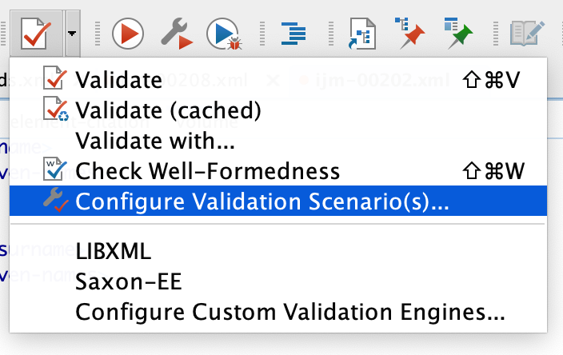
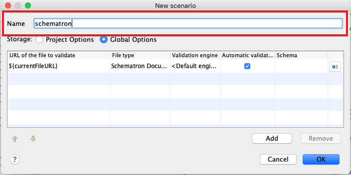
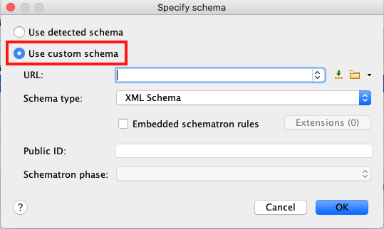
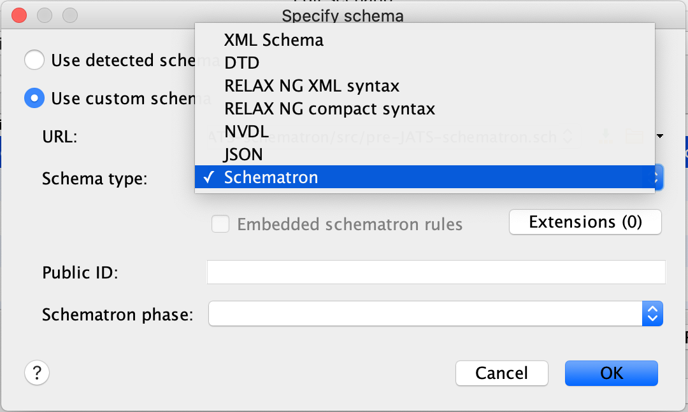

# Oxygen

## How to setup a validation scenario \(for Schematron\)

1. First, ensure that you have cloned a version of the [**elife Schematron**](https://github.com/elifesciences/eLife-JATS-schematron) to you local machine, in a suitable location, such as in your Documents folder.
2. Open any XML file in Oxygen.
3. In the toolbar, click 'Configure Validation Scenario\(s\)'

      4. In the pop-up, click 'New'

      5. In that Pop-up, rename the scenario to something appropriate, for example if setting up a scenario for the pre-author version of the eLife Schematron, you could name it 'eLife Pre'.

       6. For storage, tick 'Global options':

      7. Click the cog symbol in the furthest right column:

        8. In the specify schema pop-up, select 'Use custom schema':

        9. Click the folder symbol next to the URL field, navigate to and select the Schematron file which you would like to set up the validation scenario for \(either `pre-JATS-schematron.sch` or `final-JATS-schematron.sch`\):

        10. The Schema type should also automatically update to 'Schematron' upon selection of a Schematron file, but if it doesn't, then this will need to be changed:

        11. Click OK. Click OK in the next pop-up, and then in the last pop-up click 'Save and close' \(in the bottom left\):

You have now created a validation scenario. You can then run this scenario on numerous different XML files by opening the 'Configure Validation Scenario\(s\)' pop-up, ticking the scenario with the name which you just created, and then clicking 'Apply associated \(1\)'.

