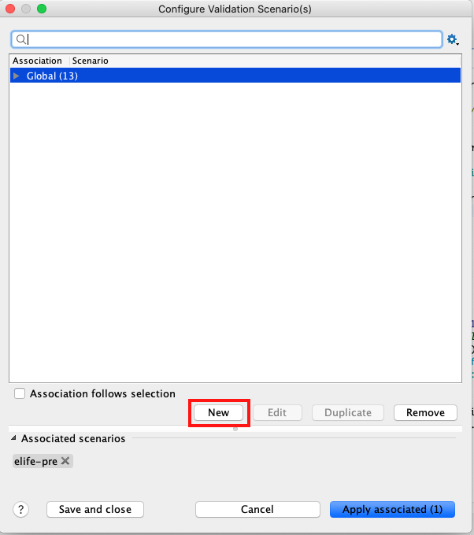
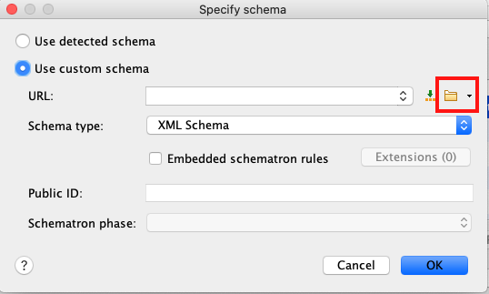

# Oxygen

## How to setup a validation scenario \(for Schematron\)

1. First, ensure that you have cloned a version of the [**elife Schematron**](https://github.com/elifesciences/eLife-JATS-schematron) to you local machine, in a suitable location, such as in your Documents folder.
2. Open any XML file in Oxygen.
3. In the toolbar, click 'Configure Validation Scenario\(s\)'

      4. In the pop-up, click 'New'

      5. In that Pop-up, rename the scenario to something appropriate, for example if setting up a scenario for the pre-author version of the eLife Schematron, you could name it 'eLife Pre'.

       6. For storage, tick 'Global options':

      7. Click the cog symbol in the furthest right column:

        8. In the specify schema pop-up, select 'Use custom schema':

        9. Click the folder symbol next to the URL field, navigate to and select the Schematron file which you would like to set up the validation scenario for \(either `pre-JATS-schematron.sch` or `final-JATS-schematron.sch`\):

        10. The Schema type should also automatically update to 'Schematron' upon selection of a Schematron file, but if it doesn't, then this will need to be changed:

        11. Click OK. Click OK in the next pop-up, and then in the last pop-up click 'Save and close' \(in the bottom left\):

You have now created a validation scenario. You can then run this scenario on numerous different XML files by opening the 'Configure Validation Scenario\(s\)' pop-up, ticking the scenario with the name which you just created, and then clicking 'Apply associated \(1\)'.

## How to set up the Crossref transformation scenario

1. Download the zip below, unzip it \(inside should be a file called `crossref.xsl`\) and place it somewhere on your local machine such as your desktop.



2. Open any XML file in Oxygen.

3. In Oxygen's top toolbar, click 'Configure Transformation Scenarios' \(or press cmd + shift + t\).

4. Click 'New' -&gt; XML transformation with XSLT.

5. Rename the scenario something appropriate, like crossref.

6. Click the folder for XSL URL, and navigate to where your local version of crossref.xsl was placed.

7. Ensure that one of the following is selected for the 'Transformer':

* Saxon-PE
* Saxon-HE
* Saxon-EE

\(Saxon-PE is preferable if it is an option\)

8. Click 'Output'.

9. Click 'Save as', and in the field next to it paste the following: `elife-crossref-${xpath_eval(substring-after(doc('${rootMapURL}')//publisher_item/item_number[@item_number_type="article_number"]/text(),'e'))}-${xpath_eval(format-dateTime(current-dateTime() + xs:dayTimeDuration('PT30M'), '[Y0001][M01][D01][H01][m01][s01]'))}.xml`

10. Click 'OK', and then click 'Save and close'

